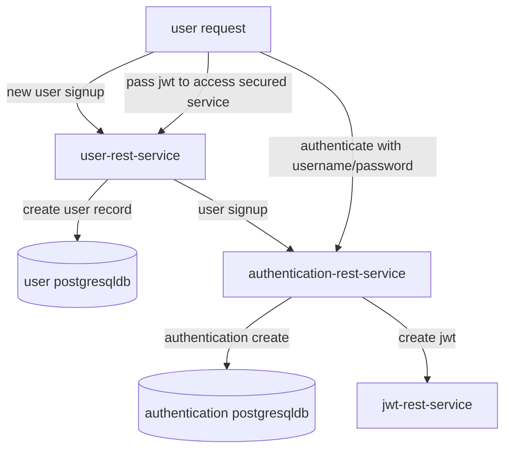

# sonamsamdupkhangsar.github.io

medium articles
linkedin

### integration of microservices

```mermaid
flowchart TD
    A[user request] --> |new user signup| B[user-rest-service]
    B[user-rest-service] -->|create user record| E[(user postgresqldb)]
    B[user-rest-service] -->|user signup| C[authentication-rest-service]
    C -->|authentication create| D[(authentication postgresqldb)]    
    A[user request] --> |authenticate with username/password| C[authentication-rest-service]
    C --> | create jwt| F[jwt-rest-service]
    A -->|pass jwt to access secured service| B[user-rest-service]

```