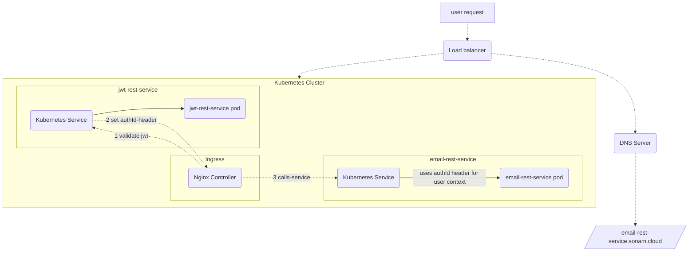
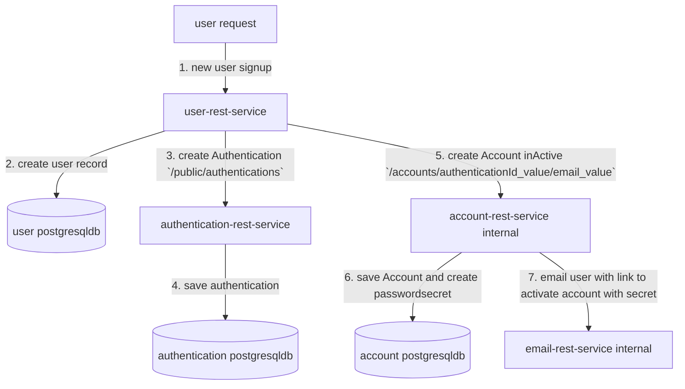
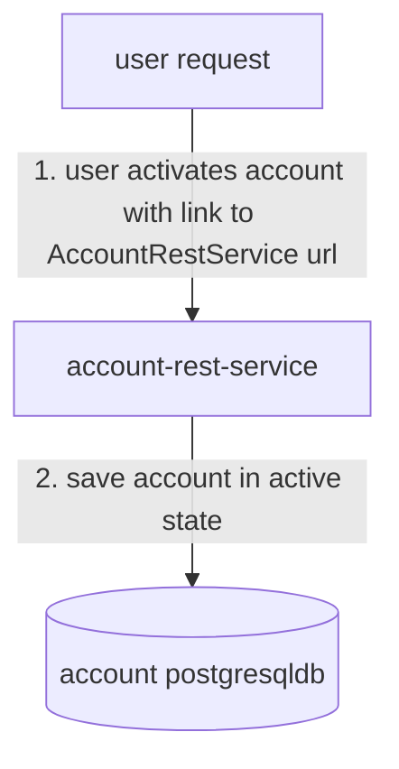
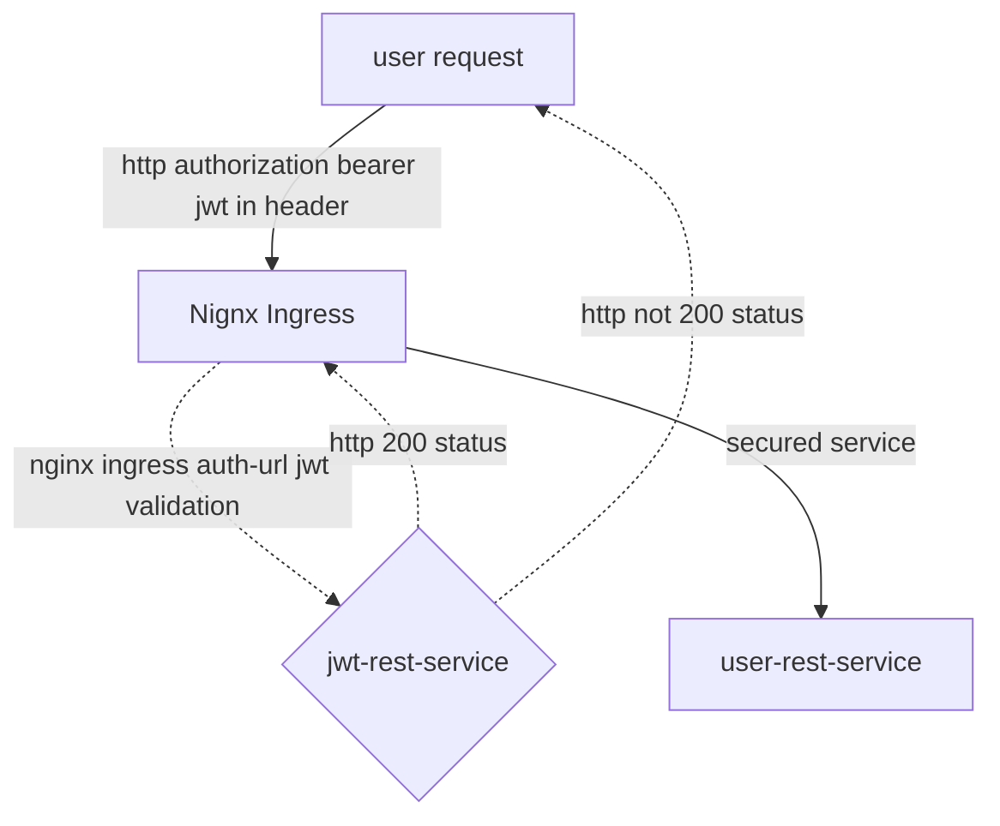

# sonamsamdupkhangsar.github.io

### integration of microservices
I have been working on some microservices developed using Java with Spring Reactive.
These services are in my github repositories.

I currently have the services deployed on a Kubernetes cluster using a Nginx Ingress controller.  

### Kubernetes cluster
The following diagram shows the request flow on a Kubernetes cluster.



#### User Signup diagram


#### User Activate Account diagram


#### User Authentication diagram

```mermaid
flowchart TD
    UserRequest[user request] --> |1. authenticate with username/password `/public/authentications/authenticate`| AuthenticationRestService[authentication-rest-service]    
    AuthenticationRestService --> |2. check account for active state| AccountRestService[account-rest-service]
    AuthenticationRestService --> |3. create jwt| JwtRestService[jwt-rest-service internal]    
    JwtRestService -. 4. JWT token .-> UserRequest    
``` 

#### User Access protected resource diagram
The dashed line indicates the jwt validation that occurs when a request is 
routed to jwt-rest-service by the Nginx Ingress controller.  The redirection
occurs using the Nginx ingress annotation for "auth-url" annotations in the ingress.yaml
file:
```
annotations:
    nginx.ingress.kubernetes.io/auth-url: "https://$host/oauth2/auth"
```


