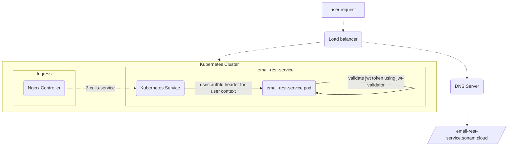

# sonamsamdupkhangsar.github.io

### integration of microservices
I have been working on some microservices developed using Java with Spring Reactive.
These services are in my github repositories.

I currently have the services deployed on a Kubernetes cluster using a Nginx Ingress controller.  

### Kubernetes cluster
The following diagram shows the request flow on a Kubernetes cluster.

Articles

1.  [How to use Maven dependency from Github repository and in your project](/pulling-down-github-maven-library/README.md)
2. [How to build custom authentication with Nginx Ingress](/custom-nginx-authentication-with-auth-url-annotation/README.md)