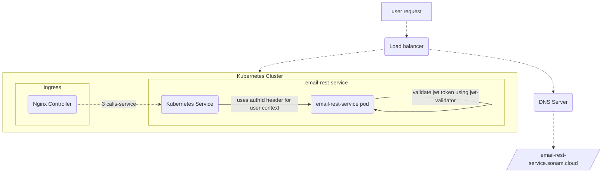

# sonamsamdupkhangsar.github.io
Some links

1. My [Helm chart](https://github.com/sonamsamdupkhangsar/sonam-helm-chart).
2. Some articles of mine on [medium](https://medium.com/@sonamhava) 
3. My messaging app [kecha](https://kecha.sonam.cloud)
4. [How to use Maven dependency from Github repository and in your project](/pulling-down-github-maven-library/README.md)
5. [How to build custom authentication with Nginx Ingress](/custom-nginx-authentication-with-auth-url-annotation/README.md)
6. [Catalogue Rest API with SwaggerUI](./rest-api-catalog-swaggerui/README.md)
7. [OpenApi Rest design](./restapi-spec-with-openapi/README.md)
8. [Consumer driven contract testing](./rest-api-contract-driven-testing/README.md)
9. Java Spring Stuff 

    a. [Building custom Yaml properties in Spring based application](/java-spring-stuff/building-custom-yaml-properties/README.md)

    b. [Retrieve the custom error message from a webservice call on Spring Reactivce stack](/java-spring-stuff/get-error-message-in-webclient-error/README.md)
    
    c. [Create custom page type in a Rest call on Spring Reactive stack](/java-spring-stuff/map-page-response-from-webclient/README.md) 
    
    d. [How to mock user for calling api that is secured using OAuth2 configuration](/java-spring-stuff/spring-security-jwt-mocking/README.md)
10. [How to pass variables to dockerfile instruction](/dockerfile/passing-secrets-docker-build/README.md)    
11. [Service Discovery with Spring and Eureka](/service-discovery/README.md)

Some personal stuff I am working on:
User Signup and Authentication And Authorization using the following micrservice projects:
* [Authorization server](https://github.com/sonamsamdupkhangsar/authorization) 
   - deploy newrelic-sealed.yaml: contains new relic license key.
* [authentication-rest-service](https://github.com/sonamsamdupkhangsar/authentication-rest-service)
* [user-rest-service](https://github.com/sonamsamdupkhangsar/user-rest-service)
* [account-rest-service](https://github.com/sonamsamdupkhangsar/account-rest-service)
* [email-rest-service](https://github.com/sonamsamdupkhangsar/email-rest-service)
* [role-rest-service](https://github.com/sonamsamdupkhangsar/role-rest-service)
* [organzation-rest-service]((https://github.com/sonamsamdupkhangsar/organization-rest-service))

[User signup flow](/microservices/user-signup-activation-flow/README.md) 

### Kubernetes cluster
The following diagram shows the request flow on a Kubernetes cluster.

