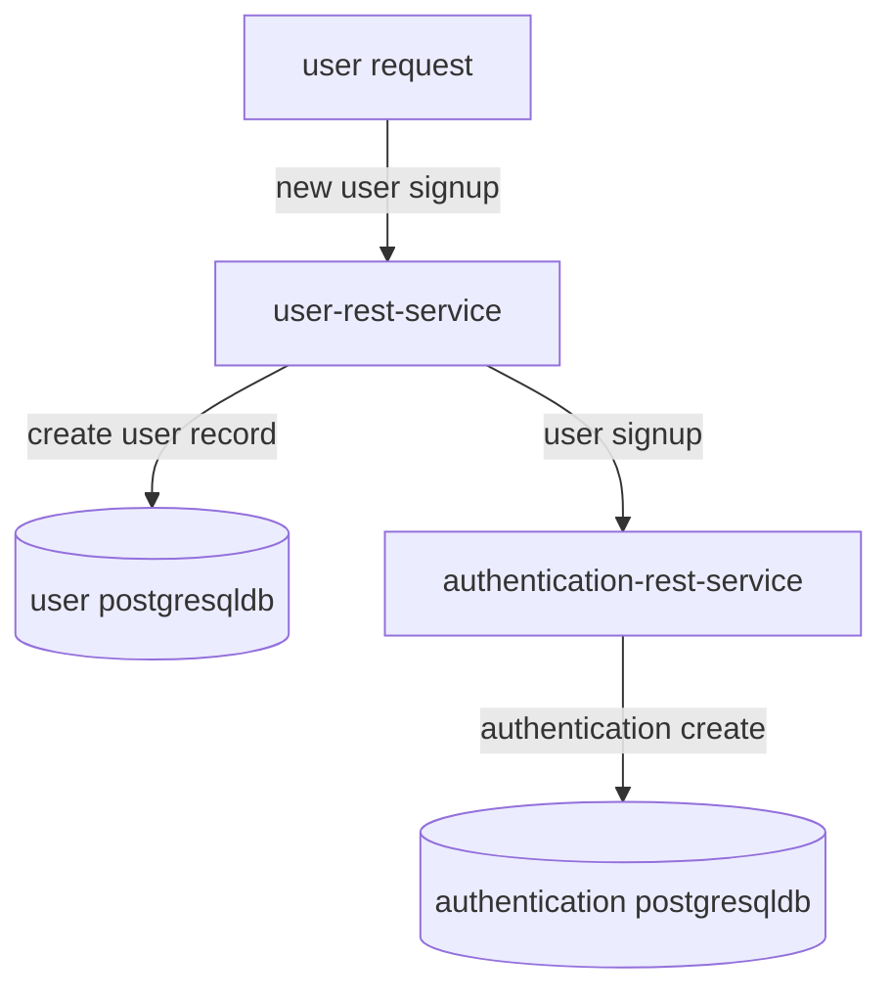
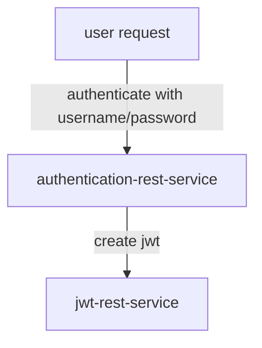
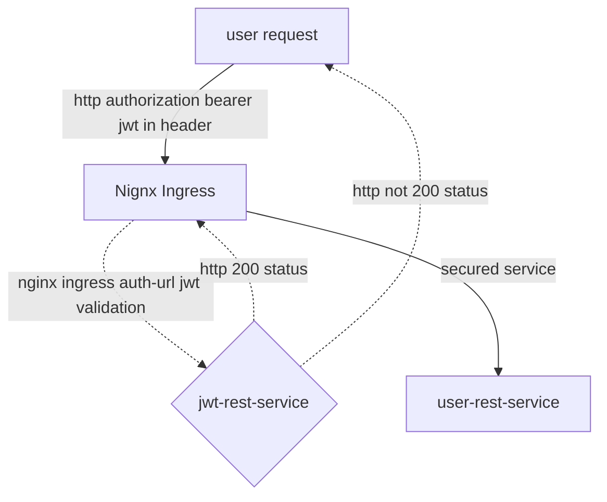

# sonamsamdupkhangsar.github.io

### integration of microservices
I have been working on some microservices developed using Java with Spring Reactive.
These services are in my github repositories.

I currently have the services deployed on a Kubernetes cluster using a Nginx Ingress controller.  

### Kubernetes cluster
The following diagram shows the request flow on a Kubernetes cluster.

```mermaid
flowchart TD
    A[user request] -.-> B(Load balancer)
    B -.-> C(DNS Server)
    C -.-> D[/pactbroker.sonam.cloud/]
    subgraph k8[Kubernetes Cluster]
    subgraph ingress[Ingress]
    F(Nginx Controller)
    end
    subgraph app[email-rest-service]
    G(Kubernetes Service)
    G --> H(email-rest-service pod)
    end    
    subgraph jwt[jwt-rest-service]
    I(Kubernetes Service)
    I --> J(jwt-rest-service pod)
    end    
    end
    F -. 3 calls-service .-> G
    F -. 1 validate jwt .-> I
    B -.-> k8
    I -. 2 set authId-header .->
    
```

#### User Signup diagram


#### User Authentication diagram



#### User Access protected resource diagram
The dashed line indicates the jwt validation that occurs when a request is 
routed to jwt-rest-service by the Nginx Ingress controller.  The redirection
occurs using the Nginx ingress annotation for "auth-url" annotations in the ingress.yaml
file:
```
annotations:
    nginx.ingress.kubernetes.io/auth-url: "https://$host/oauth2/auth"
```


