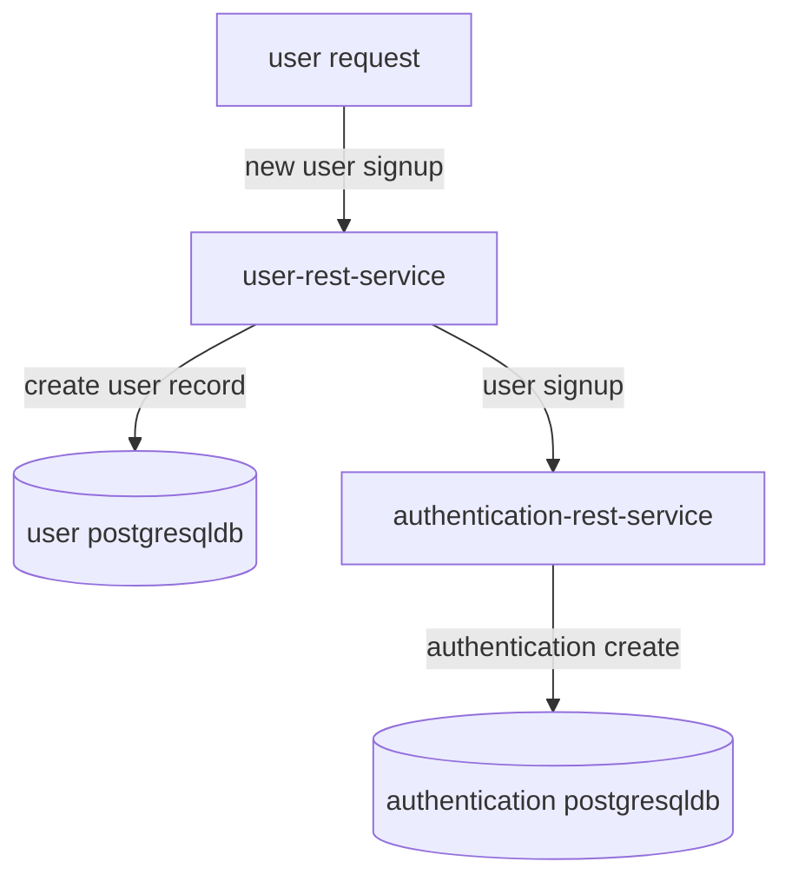
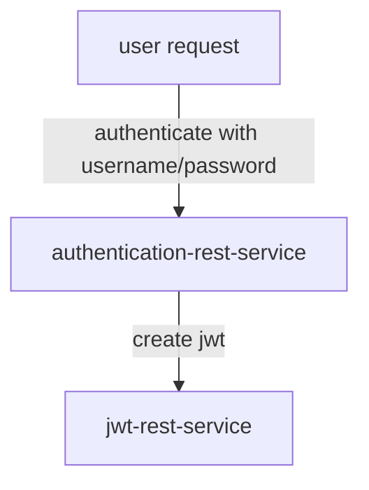
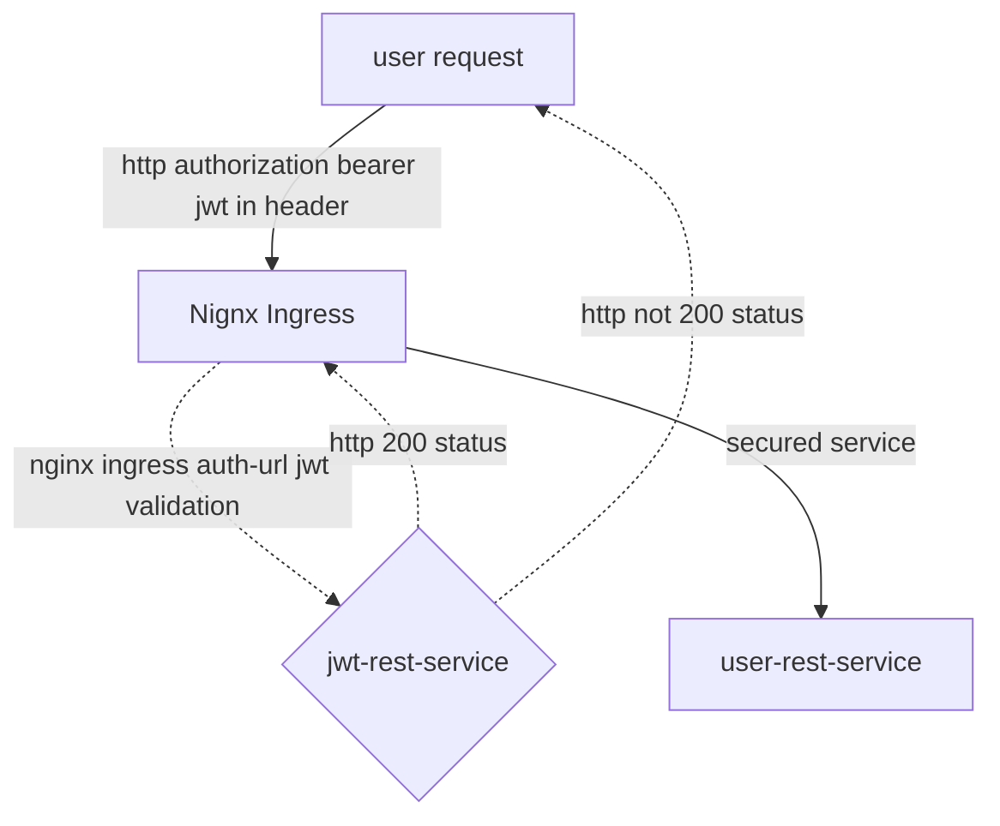

# sonamsamdupkhangsar.github.io

### integration of microservices
I have been working on some microservices developed using Java with Spring Reactive.
These services are in my github repositories.

I currently have the services deployed on a Kubernetes cluster using a Nginx Ingress controller.  


#### User Signup diagram


#### User Authentication diagram



#### User Access protected resource diagram
The dashed line indicates the jwt validation that occurs when a request is 
routed to jwt-rest-service by the Nginx Ingress controller.  The redirection
occurs using the Nginx ingress annotation for "auth-url" annotations in the ingress.yaml
file:
```
annotations:
    nginx.ingress.kubernetes.io/auth-url: "https://$host/oauth2/auth"
```


