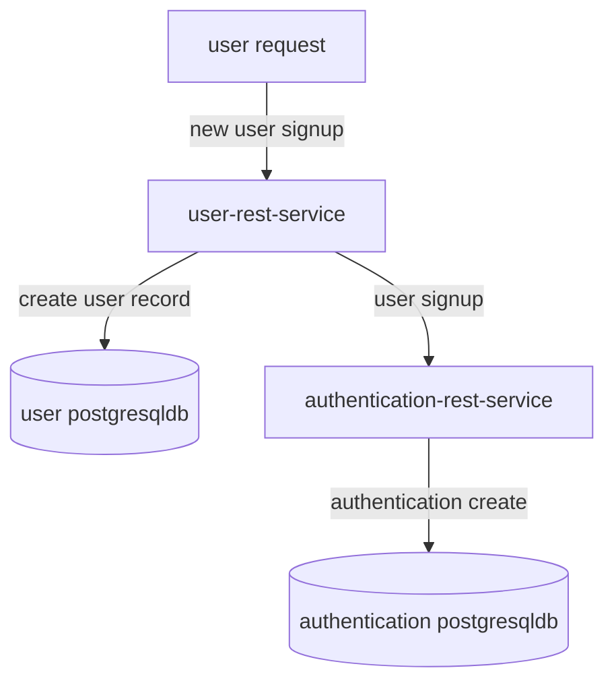
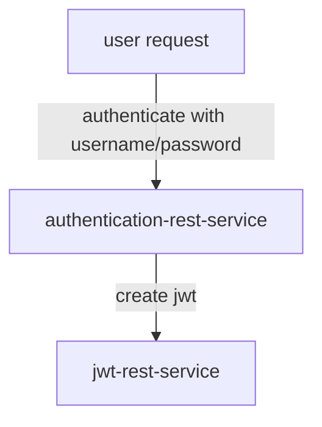
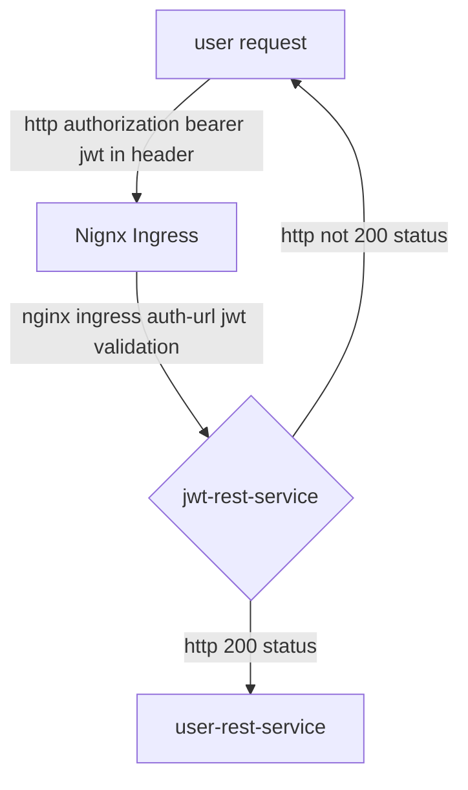

# sonamsamdupkhangsar.github.io

### integration of microservices

#### Use Signup diagram

```mermaid
flowchart TD
    A[user request] --> |new user signup| B[user-rest-service]
    B[user-rest-service] -->|create user record| E[(user postgresqldb)]
    B[user-rest-service] -->|user signup| C[authentication-rest-service]
    C -->|authentication create| D[(authentication postgresqldb)]       
```

#### User Authentication diagram

```mermaid
flowchart TD
    A[user request] --> |authenticate with username/password| B[authentication-rest-service]
    B --> | create jwt| C[jwt-rest-service]    
``` 

#### User Access protected resource diagram

```mermaid
flowchart TD
    A[user request] --> |http authorization bearer jwt in header| B[Nignx Ingress]
    B --> | nginx ingress auth-url jwt validation| C{jwt-rest-service}
    C --> |http 200 status| D[user-rest-service] 
    C --> | http not 200 status| A
``` 
