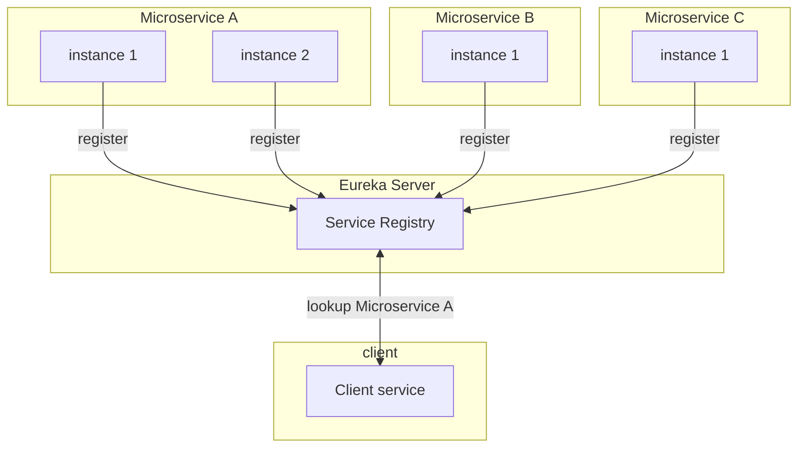
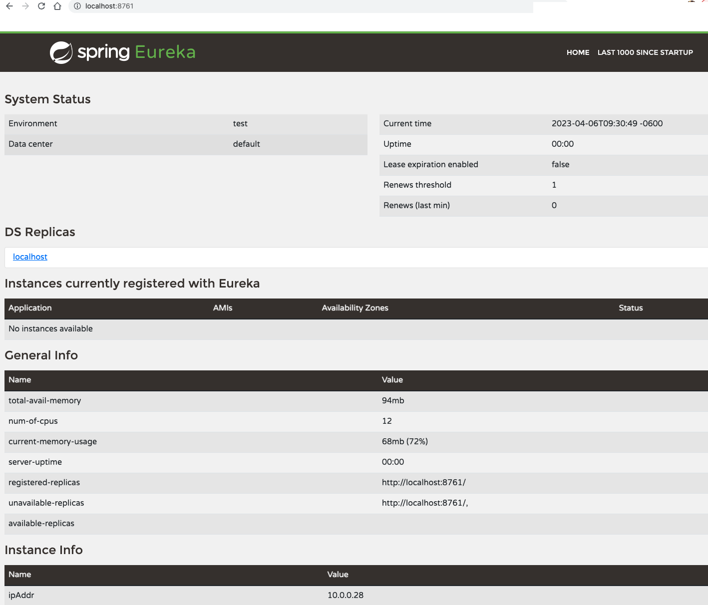
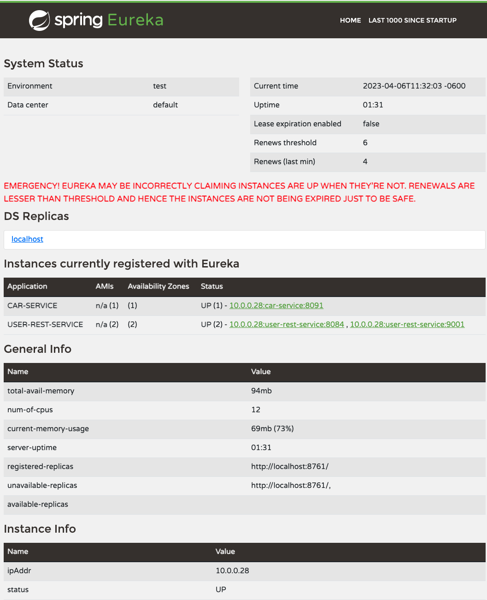

# Service Registry and Discovery for Microservices
This document shows how service registry and service discovery works.  It will use a Spring based Java application with Netflix's Eureka registry service.   It will then show how microservices can register and how clients can use discovery service for communicating with each other, without needing to know the actual ip or dns addresses.

The following is a diagram of service registration and service discovery:




## What is a Service Registry?
Service registry is a framework used for registering services.  For example, a microservice can register themselves to a Eureka server.  Once registered the services can show up on the service registry using their configured name such as `hello-world-service` or by any other name. 

## What is Service Discovery?
Service discovery is the process by which the clients will use the registry to connect to a instance of a microservice using a name.


## How does registry and discovery work in Spring based application using Eureka server?
To use Eureka in a Spring application the Eureka server component will need to be integrated within.  This Eureka server will act as the registry server where microservices can register themselves.  Once registered, any client wanting to connect and communicate with each can use service discovery to find an instance of that service to establish communication.  

### Service Registry server
A Eureka server can be created using a Springboot application.  For a maven based build use the following dependency in a `pom.xml` file:

```
<dependency>
  <groupId>org.springframework.cloud</groupId>
  <artifactId>spring-cloud-starter-netflix-eureka-server</artifactId>
</dependency>
```

In the main application class with the `@SpringBootApplication` annotation you register this application as a Eureka server with `@EnableEurekaServer` as:

```
@EnableEurekaServer
@SpringBootApplication
public class EurekaServiceApplication {
	private static final Logger LOG = LoggerFactory.getLogger(EurekaServiceApplication.class);
    
    public static void main(String[] args) {
		SpringApplication.run(EurekaServiceApplication.class, args);
	}
    ...
```

In the configuration for the Eureka service registry the username, password credentials and other configurations such as hostname can be included in the `application.yaml`:
```
eureka:
  client:
    instance:
      hostname: ${hostName}
    registerWithEureka: false
    fetchRegistry: false
    serviceUrl:
      defaultZone: ${defaultZone}

spring:
  main:
    allow-bean-definition-overriding: true
  security:
    user:
      name: ${EUREKA_USER}
      password: ${EUREKA_PASSWORD}
```      

Based on profile these variables can be defined in a profile specific filie like `application-{profile}.yaml`, such as in a application-local.yaml file:
```
defaultZone: http://localhost:8761
EUREKA_USER: test
EUREKA_PASSWORD: test
```


This should be plenty to start the application with a mvn command using the local profile:

```mvn spring-boot:run -Dspring-boot.run.arguments="--spring.profiles.active=local"```

The following is a screenshot of the Eureka server on localhost:8761 specified in application-local.yaml:




### Service Registration for Eureka clients
Applications and microservices that want to register to a Eureka registry service  are the Eureka clients.  

The process for service registration is similar to how the Eureka service registry was configured.  This example again uses a maven build and will need the following dependency in pom file:
```
<dependency>
    <groupId>org.springframework.cloud</groupId>
    <artifactId>spring-cloud-starter-netflix-eureka-client</artifactId>
</dependency>
```

In the microservices's main application class include the `@EnableEurekaClient` with the  `@SpringBootApplication` annotation as following:

```
@EnableEurekaClient
@SpringBootApplication
public class Application {
	private static final Logger LOG = LoggerFactory.getLogger(Application.class);
    
    public static void main(String[] args) {
		SpringApplication.run(Application.class, args);
	}
    ...
```

This makes this Spring project a Eureka client which will need to access the discovery server and can be done in the application.yaml file:

```
eureka:
  client:
    serviceUrl:
      defaultZone: ${DEFAULT_ZONE}
```

The `${DEFAULT_ZONE}` value can be overridden in a profile specific file such as `application-local.yaml` file as:

```
DEFAULT_ZONE: http://${EUREKA_USER}:${EUREKA_PASSWORD}@${EUREKA_HOST}/eureka
```
Once this Eureka client application or Spring application is started it will register itself with the Eureka registry.  The following shows a `user-rest-service` that has now registered with the discovery service:



In this example, you can find two instances of named `user-rest-service` that have registered with the discovery service and one `car-service` instance.  The names that show under the "Application" column are used for connecting to them.  This ability of a client to consume a service by their name ensures that there is no need to know  dns, ip or port information.  Consumers just need to know service name only.  

In the case of user-rest-service we have 2 horizontally scaled instances of the service registered.  This becomes useful not only for server side load balancing but also for the client side load balancing which we will see later.


### Service Discovery by clients
The consumer application of a Eureka service will have to use a loadbalanced web client for communication.  This loadbalanced client will enable to pick backend registered service that is chosen based on policies such as round-robin.  

The following is a sample webclient configuration for a Spring based app:

```
@Configuration
public class WebClientConfig {
    @LoadBalanced
    @Bean
    public WebClient.Builder webClientBuilder() {
        return WebClient.builder();
    }
}
```

This webclient builder will be injected into the service that wants to communcate with a registered service on the Eureka server. The following is an example of a loadbalanced client making a service call to `authentication-rest-service` using this name in the http address as "http://authentication-rest-service" for `authenticationEp` variable

```
   WebClient.ResponseSpec responseSpec = webClientBuilder.build()
   .post().uri(authenticationEp).bodyValue(payloadMap).retrieve();
```                            


# Conclusion
A service registry and its discovery provides a abstraction layer for applications that are looking to consume another service by name.  I find that is a great convenience because consumers don't have to know or beware of application url or the local cluster information and port to access another service.  

Depending on the target platform there may already be server side load balancing features such as using a Kubernetes service.  But the discovery service also allows the application to be deployed on any platform to take advantage of client side load balancing features as well.

In terms of disadvantages, the discovery service is another infrastructure that must be deployed and scaled as well.  But since it is used for lookup rather than processing any messages I do think the chances of it being unavailable are rare.

For this article, I have used my [discovery-service](https://github.com/sonamsamdupkhangsar/discovery-service) and [user-rest-service](https://github.com/sonamsamdupkhangsar/user-rest-service) projects.