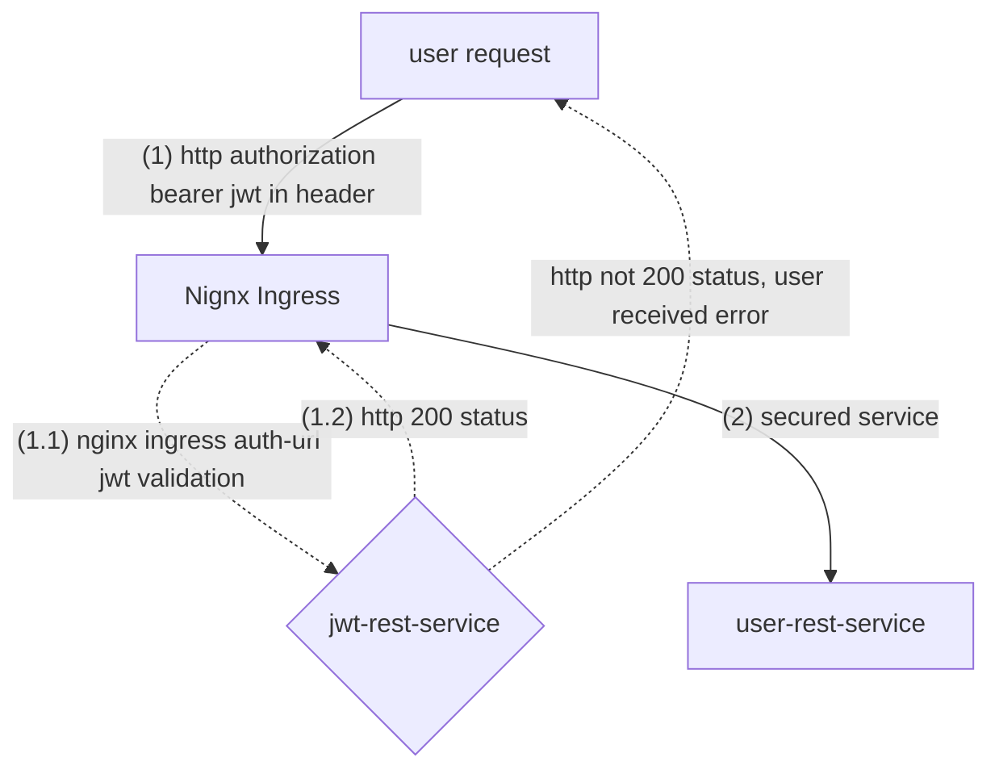

# Customize Authentication for Nginx Ingress Controller
This is a short content about implementing authentication with Nginx Ingress controller in a Kubernetes cluster.

<br/>

## Workflow
I have a service named `user-rest-service` that provides some user service.  Now, I want to secure it by checking user requests for a JWT token that is valid with a service called `jwt-rest-service`.  For valid we will check that the token has not expired by time.


If the JWT token is not expired then it will return a Http 200 status.  If JWT is expired it will return a Http 400 response code.

<br/>
The following is the workflow with numbers reflecting the workflow sequence:



To achieve this you can deploy your service `jwt-rest-service` first that validates the JWT token.  Then in the `user-rest-service` configuration your nginx ingress configuration must have the following annotation line:

```
annotations:
    nginx.ingress.kubernetes.io/auth-url: "https://$host/oauth2/auth"
```

This nginx ingress configuration will ensure that before Nginx serves your request to the `user-rest-service` it will forward to the auth-url endpoint to validate the request.

There are instances where you might want to return a custom header from your authentication service.  The following example shows in Java a custom header returned in a handler code:
```
   return jwt.validate(serverRequest.headers().firstHeader("Authorization").replace(bearer, ""))
                .flatMap(map -> {
                    LOG.info("set subject in http header");
                   return ServerResponse.ok()
                            .contentType(MediaType.APPLICATION_JSON)
                           .headers(httpHeaders -> httpHeaders.set("authId", map.get("subject")))
                            .bodyValue(map);
                })
                .onErrorResume(throwable ->
                    ServerResponse.status(HttpStatus.UNAUTHORIZED).contentType(MediaType.APPLICATION_JSON)
                        .bodyValue(throwable.getMessage())
                );
```

In order for Nginx to pass the header to the service being intercepted you add the following additional annotation line to get that header forwarded into your service:

```
annotations:
    nginx.ingress.kubernetes.io/auth-url: http://jwt-rest-service-mychart.backend.svc.cluster.local:80/validate
    # pass authId header returned from jwt-rest-service validation of jwt token
    nginx.ingress.kubernetes.io/auth-response-headers: authId
```

This is a convenient way to implement a simple authentication service using Nginx ingress configuration.  