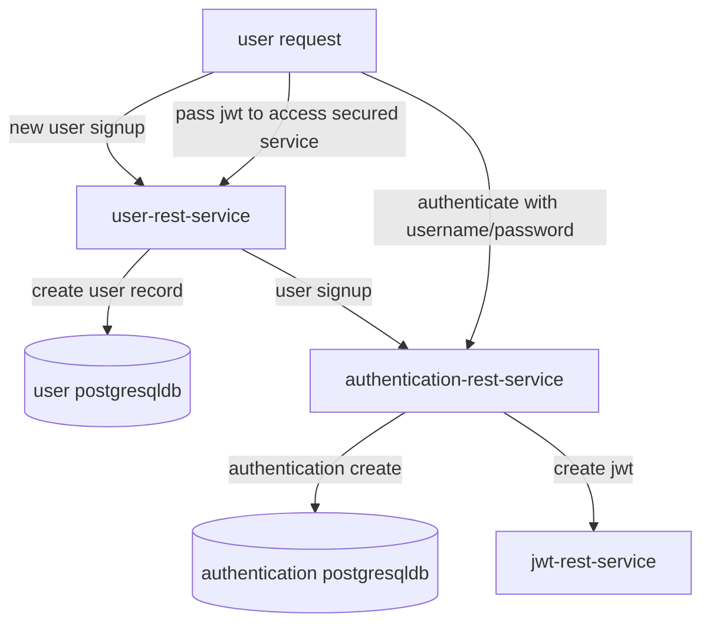

## Welcome to my page

I like working with Kubernetes so I have a k8 cluster that uses Nginx Ingress controller.
I have several repository on Github that deploys on my k8 cluster using
my [Helm chart](https://github.com/sonamsamdupkhangsar/sonam-helm-chart).

I wrote a few [medium](https://medium.com/@sonamhava) articles based on my experience working with Nginx and Kubernetes.

I have built a messaging webapp for Android and Ios.  My messaging app is hosted
on [kecha](https://kecha.sonam.cloud).  Now, I am working on refactoring the backen-services
into microservices.  

I am working on building separate services for each domain
such as user, authentication, s3 storage, thumbnail generation, emailing, and remote notifications for Firebase and Apple Push Notification services.

### microservice projects
[jwt-rest-service](https://github.com/sonamsamdupkhangsar/jwt-rest-service)

[user-rest-services](https://github.com/sonamsamdupkhangsar/user-rest-service)

[authentication-rest-services](https://github.com/sonamsamdupkhangsar/authentication-rest-service)

[s3-rest-service](https://github.com/sonamsamdupkhangsar/s3-rest-service)

[email-rest-service](https://github.com/sonamsamdupkhangsar/email-rest-service)

[thumbnail-s3-rest-service](https://github.com/sonamsamdupkhangsar/thumbnail-s3-rest-service)

### integration of microservices
