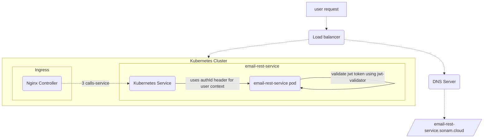

## Welcome to my page
Github Pages do not support mermaidjs rendering by default. Use 
[README](https://github.com/sonamsamdupkhangsar/sonamsamdupkhangsar.github.io) for now.

1. My [Helm chart](https://github.com/sonamsamdupkhangsar/sonam-helm-chart).
2. Some articles of mine on [medium](https://medium.com/@sonamhava) 
3. My messaging app [kecha](https://kecha.sonam.cloud)
4. [How to use Maven dependency from Github repository and in your project](/pulling-down-github-maven-library/README.md)
5. [How to build custom authentication with Nginx Ingress](/custom-nginx-authentication-with-auth-url-annotation/README.md)

6. [Catalogue Rest API with SwaggerUI](./rest-api-catalog-swaggerui/README.md)
7. [OpenApi Rest design](./restapi-spec-with-openapi/README.md)

Some personal stuff I am working on:

1. [User signup flow](/microservices/user-signup-activation-flow/README.md) 

### Kubernetes cluster
The following diagram shows the request flow on a Kubernetes cluster.

