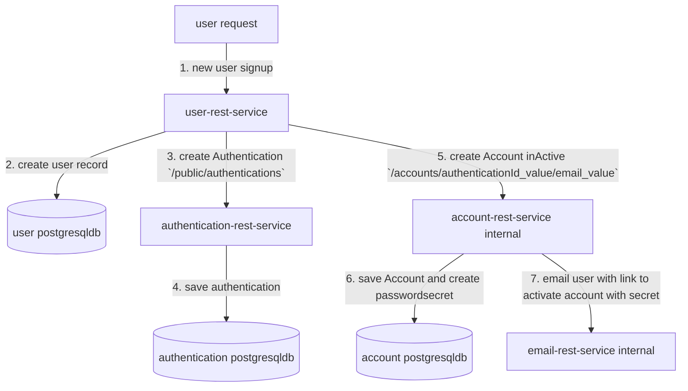
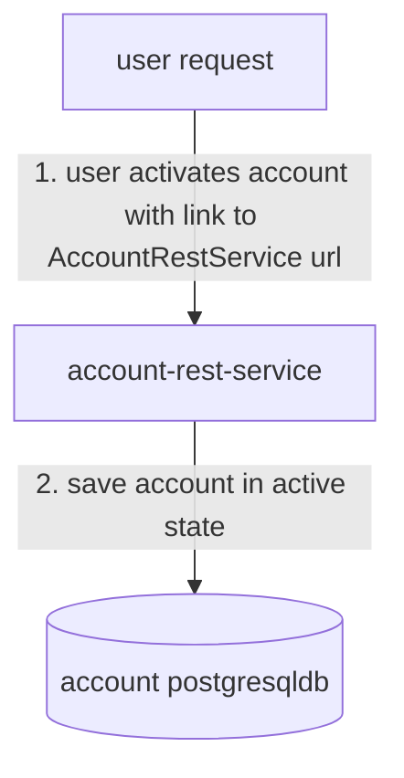

# User Signup Workflow
The following shows the user signup workflow using the user-rest-service, authentication-rest-service and account-rest-service.





#### User Activate Account diagram


#### User Authentication diagram

```mermaid
flowchart TD
    UserRequest[user request] --> |1. authenticate with username/password `/public/authentications/authenticate`| AuthenticationRestService[authentication-rest-service]    
    AuthenticationRestService --> |2. check account for active state| AccountRestService[account-rest-service]
    AuthenticationRestService --> |3. create jwt| JwtRestService[jwt-rest-service internal]    
    JwtRestService -. 4. JWT token .-> UserRequest    
``` 
