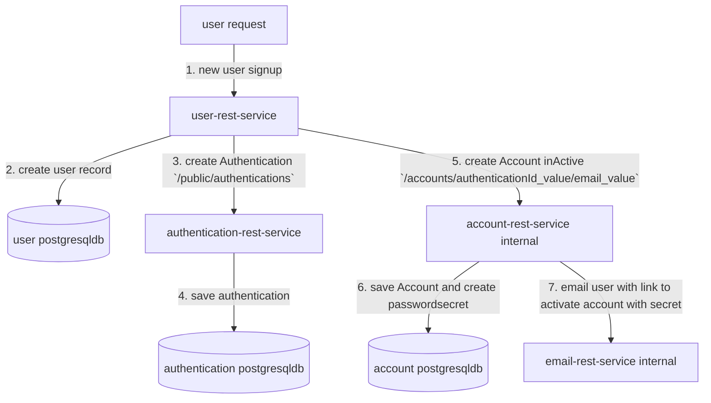

# User Signup Workflow
The following shows the user signup workflow using the user-rest-service, authentication-rest-service and account-rest-service.

#### User Signup diagram

```mermaid
flowchart TD
    UserRequest[user request] --> |1. new user signup| UserRestService[user-rest-service]
    UserRestService -->|2. create user record| UserPgsqlDb[(user postgresqldb)]
    UserRestService -->|3. create Authentication `/public/authentications` | AuthenticationRestService[authentication-rest-service]
    AuthenticationRestService -->|4. save authentication| AuthenticationPgsqlDb[(authentication postgresqldb)]
    UserRestService -->|5. create Account inActive `/accounts/authenticationId_value/email_value`| AccountRestService[account-rest-service internal]
    AccountRestService -->|6. save Account and create passwordsecret| AccountPgsqlDb[(account postgresqldb)]
    AccountRestService --> |7. email user with link to activate account with secret| EmailRestService[email-rest-service internal]    
```