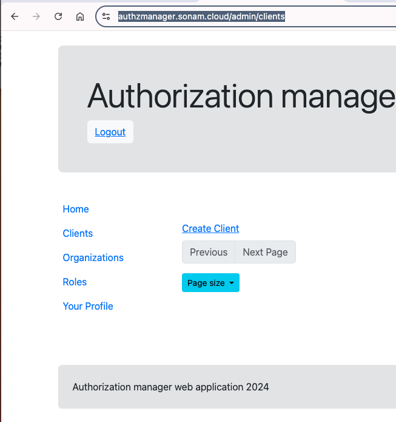
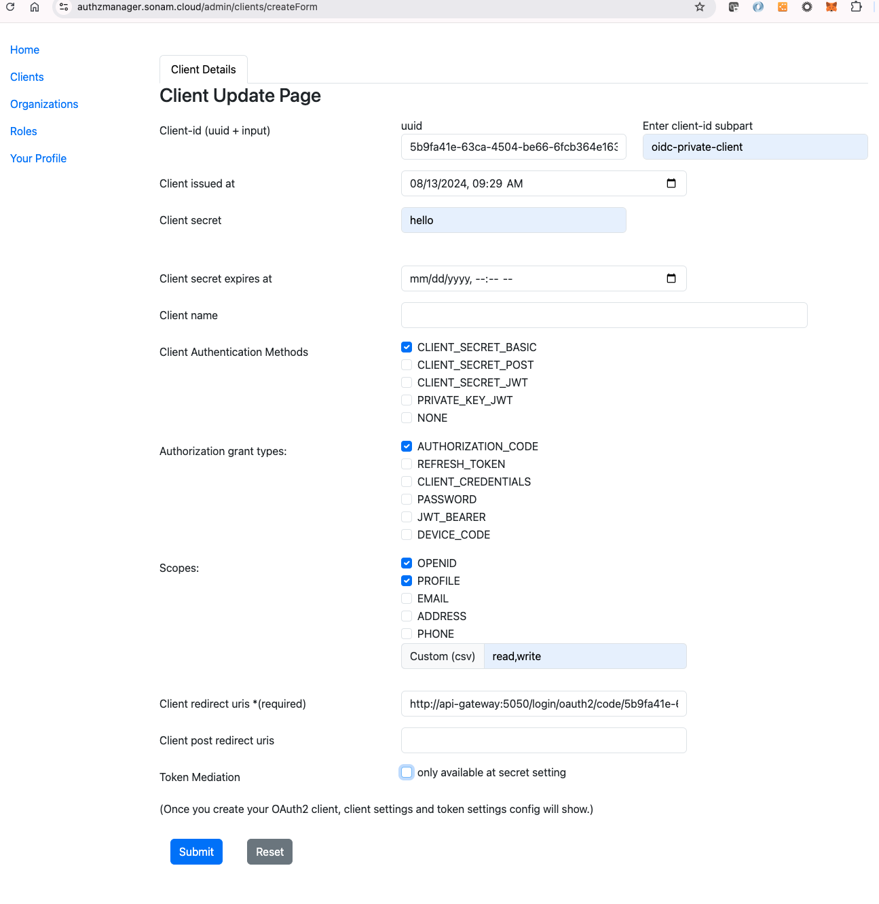
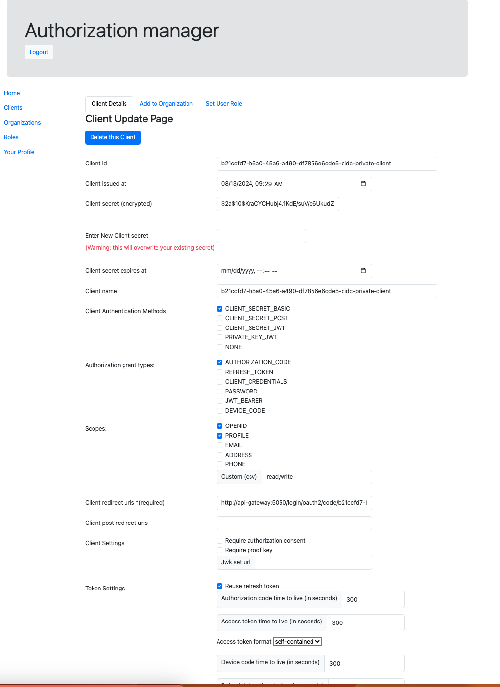
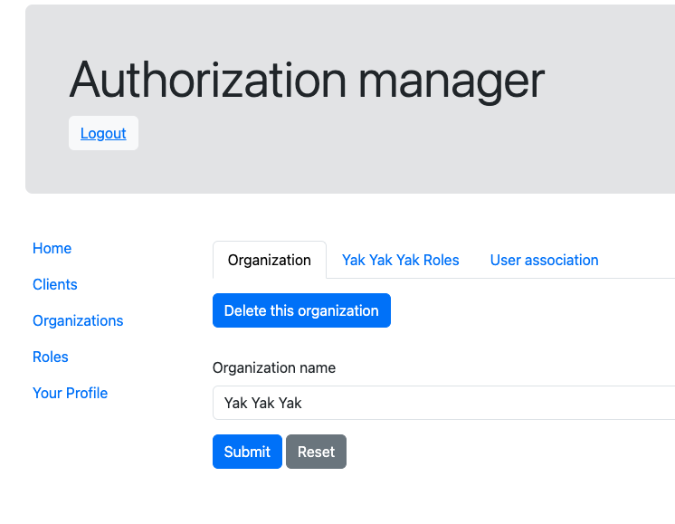
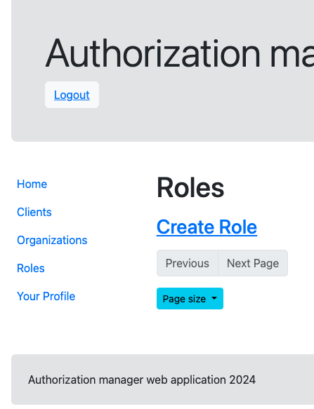
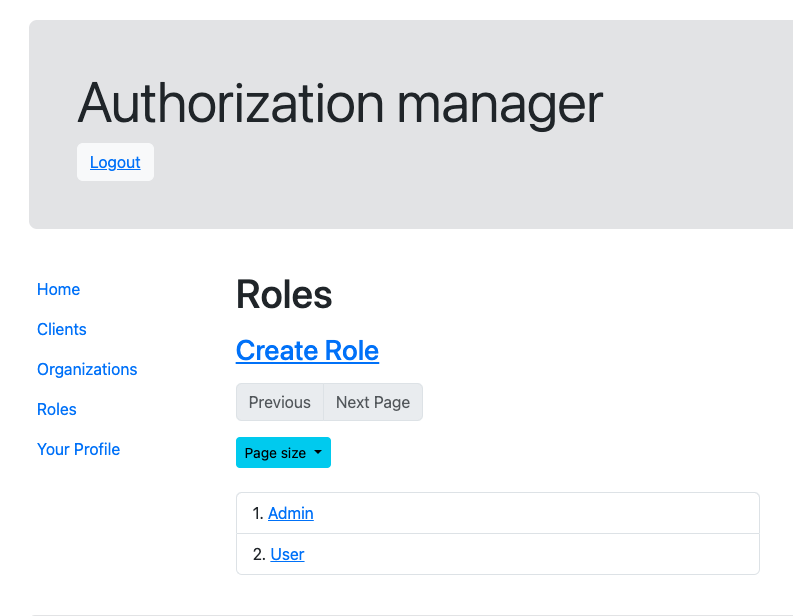
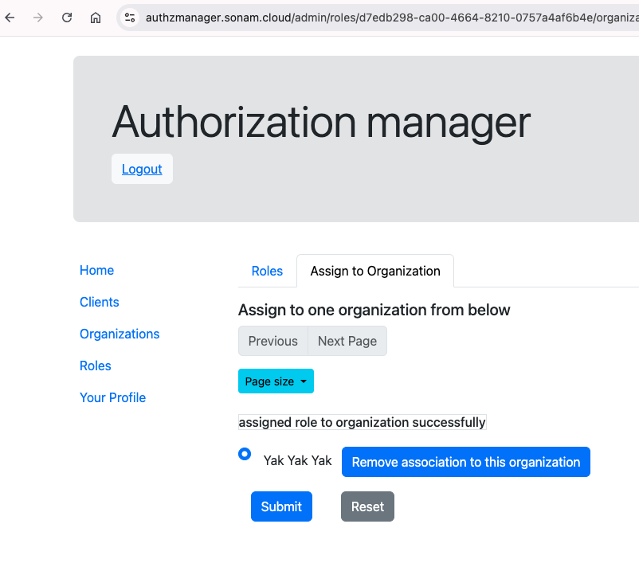
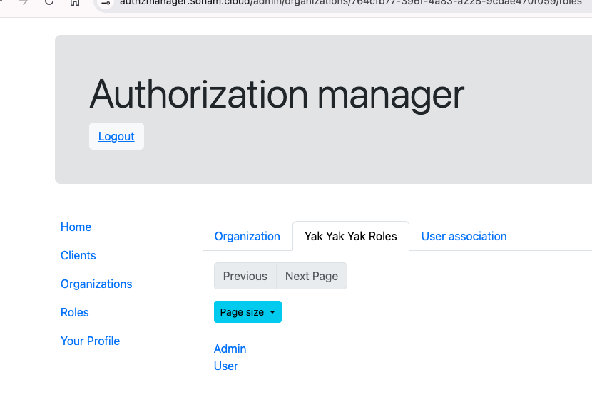
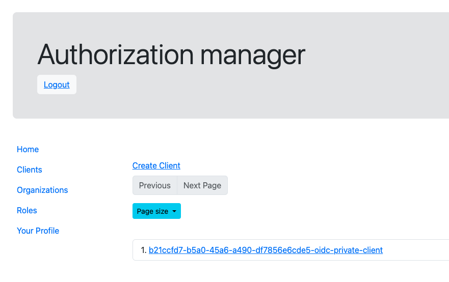
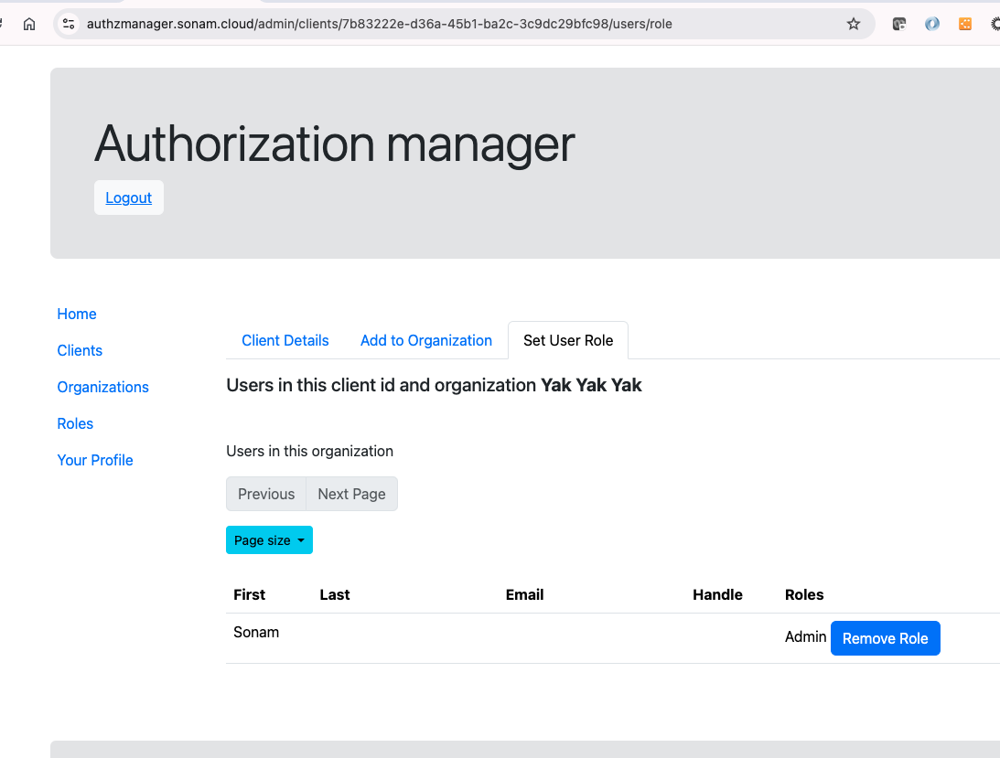

# Create OAuth2 app
Once you are logged-in you can create a OAuth2 app by navigating to [Clients](https://authzmanager.sonam.cloud/admin/clients) page. 

In this example, I am going to create a OAuth2 app for a Java application.  This server side app will display the user's access-token when authenticated.  This is for demo purposes only.

Click on `Create Client` link.  I have pasted an image of my client .

The `Client-id` field will be set with a UUID of type 4 in the text field.  It is auto-generated and appended with the `Enter client-id subpart` input.  The UUID helps to ensure that the client-id will be unique.

I have entered the `Client issued at` field using a calendar.  The secret is set to `hello`.  The other fields I have set are the Client Authentication Methods to be `CLIENT_SECRET_BASIC` for basic authentication for this client.  For Authorization grant types I have selected using Authorization Code.  I have also added some scopes that are available such as `OPENID`, `PROFILE` and a few custom ones like `read` and `write`.

I also provide the redirect uri once the user is authenticated to go back to the application url.

When you hit the submit button it will create the OAuth2 client and should see the saved client as follows 

# Create Organization
This Organization (org) is to group a OAuth2 client app to a org and to a Role.
I created one called `Yak Yak Yak` org using the [Organizations](https://authzmanager.sonam.cloud/admin/organizations).

To assign roles to this organization, we need to create the roles by clicking on the `Roles` link .  

Create a simple role like `Admin` and `User` like shown.  When you create the roles you can also assign them to the organization . I have assigned both roles to `Yak Yak Yak` organization.

Now if you go back to [Organizations](https://authzmanager.sonam.cloud/admin/organizations) you will see the roles assigned to it .

If you click on the `User association` tab you will see by default the person that created the org. You can also add other people by searching in the textfield by their username .

Now we will go back to the Clients again to find the one we created earlier  and select that client.  However, this time we want to associate the client to the organization we created first .

We then move to assign the user that is associated to the organization to be assigned a role in this OAuth2 Client .  You can select the Role for this user by selecting the available roles and assign them one .

In this page, I created a organization, and a couple of roles and assigned them to the OAuth2 client.  In the next section, a Java app will use the client and get the roles. 