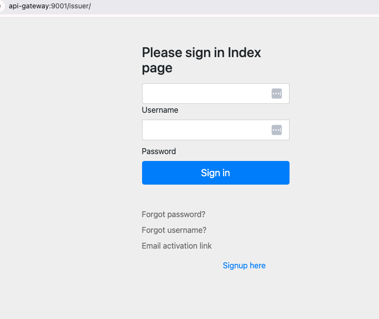
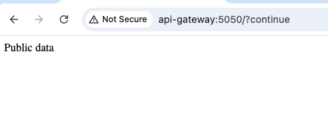
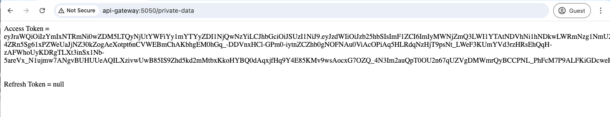
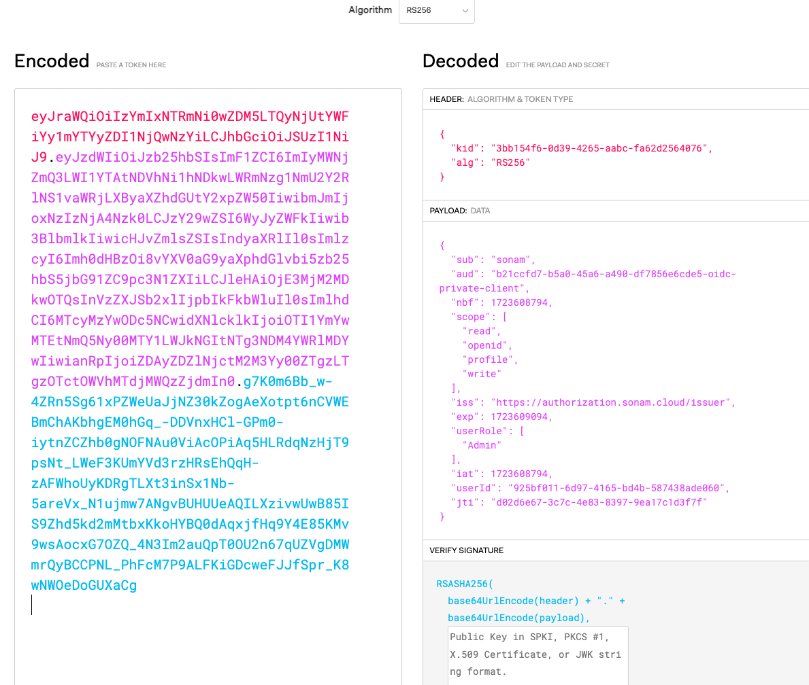

# Java OAuth2 app
In this page I will create a Springboot application that will use the OAuth2 app that was created earlier.

I found this Spring Boot app from a site that showed how to access the access-token.  I have uploaded this version to my Git [repo](https://github.com/sonamsamdupkhangsar/oidc-private-client.git).  

The Spring Boot app will be deployed at `http://api-gateway:5050` and it requires that the user is authenticated to access the base path.   I use the `api-gateway` to map to localhost.   The path `/private-data` will display the users access-token.


The OAuth2 configuration is in the [application.yaml](https://github.com/sonamsamdupkhangsar/oidc-private-client/blob/9e72035b98fd4aae50e767cfb27f8a7d226a05aa/app/src/main/resources/application.yaml#L15) file and contains:

```

spring:
  security:
    oauth2:
      client:
        registration:
          b21ccfd7-b5a0-45a6-a490-df7856e6cde5-oidc-private-client:
            client-id: b21ccfd7-b5a0-45a6-a490-df7856e6cde5-oidc-private-client
            client-secret: hello
            client-authentication-method: client_secret_basic
            authorization-grant-type: authorization_code
            redirect-uri: "{baseUrl}/login/oauth2/code/{registrationId}"
            scope:
              - openid
              - profile
              - read
              - write
        provider:
          b21ccfd7-b5a0-45a6-a490-df7856e6cde5-oidc-private-client:
            authorization-uri: ${authorizationIssuer}/oauth2/authorize
            token-uri: ${authorizationIssuer}/oauth2/token
            user-info-uri: ${authorizationIssuer}/userinfo
            jwk-set-uri: ${authorizationIssuer}/oauth2/jwks
            userNameAttribute: sub

```

I will then start the Spring Boot app with gradle command `./gradlew bootRun --args="--spring.profiles.active=local"`:

``` 
> Task :app:bootRun

  .   ____          _            __ _ _
 /\\ / ___'_ __ _ _(_)_ __  __ _ \ \ \ \
( ( )\___ | '_ | '_| | '_ \/ _` | \ \ \ \
 \\/  ___)| |_)| | | | | || (_| |  ) ) ) )
  '  |____| .__|_| |_|_| |_\__, | / / / /
 =========|_|==============|___/=/_/_/_/
 :: Spring Boot ::                (v3.2.5)

2024-08-13T22:02:28.620-06:00  INFO 68748 --- [           main] oidc.MySpringBoot ...(REDACTED LOGS)
2024-08-13T22:02:29.852-06:00  INFO 68748 --- [           main] oidc.MySpringBootApplication             : Started MySpringBootApplication in 1.529 seconds (process running for 1.766)
```

This Spring Boot starts at port 5050 on localhost.  When I enter the `http://api-gateway:5050` I will be redirected to the Authorization Server to .

After entering my credentials, I am redirected to my .  And when I enter the `http://api-gateway:5050/private-data` url I can view the .

To decode the access token I will use jwt.io web page to show the contents of the .  You can find the subject information, the audience, scopes and most importantly the role we assigned to the OAuth2 client of `Admin` role.


