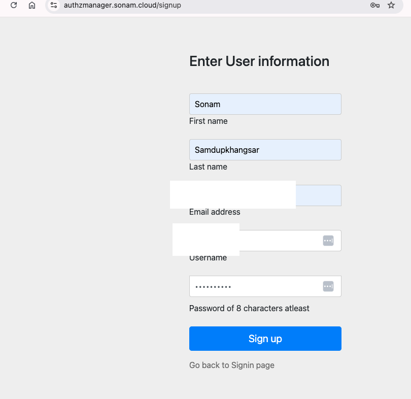
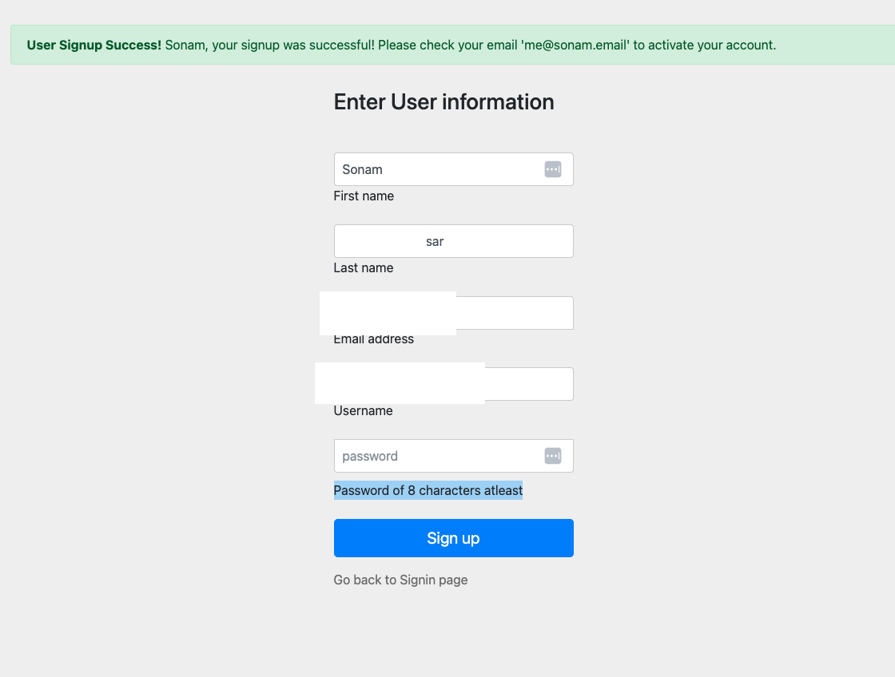
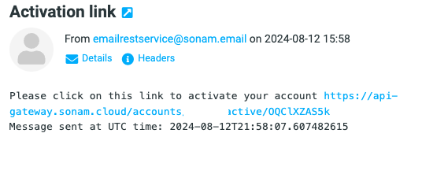
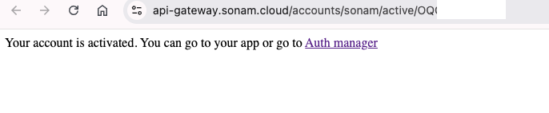
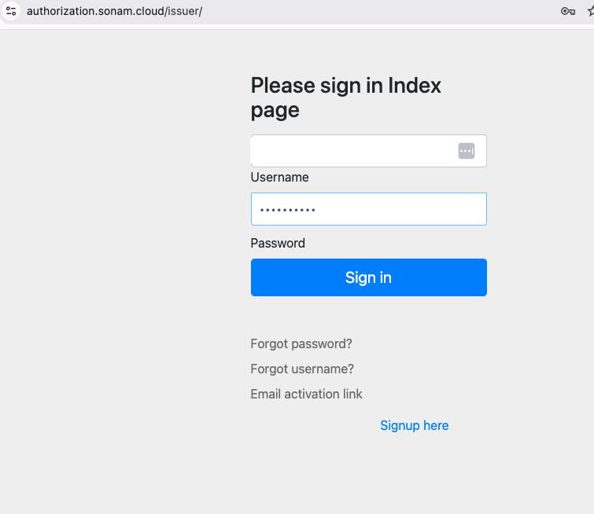
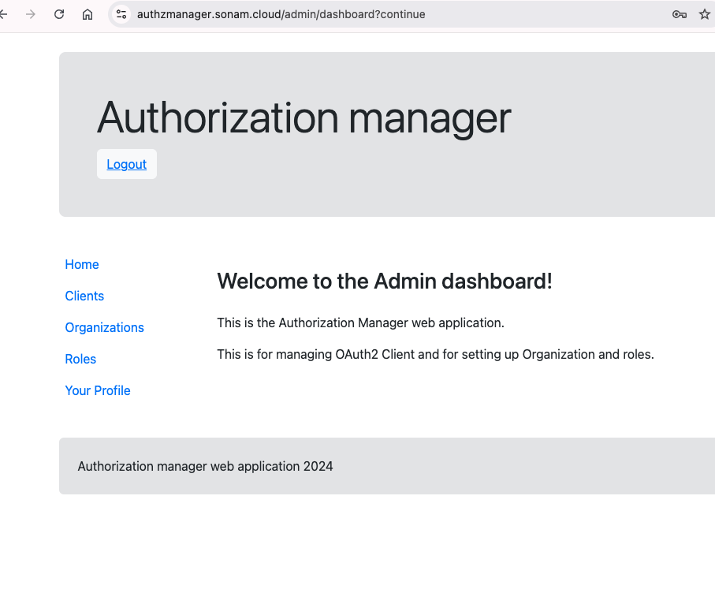

# My Authorization Server

I started building OAuth2 Client management using the Spring Authorization Server while I was laid-off in March 2024.  I had plenty of time and wanted to put a front-end to manage OAuth2 Client and for setting up user and assoiciated roles and organitions.  

There is a great resource on how to build on [Spring Authorization Server](https://docs.spring.io/spring-authorization-server/reference/index.html).  I took those information to create a Spring Boot application that can do authentication using call out to microservices.  Anyways, in short I was able to build a prototype application for managing OAuth2 clients and users.  My application is available at [authorization.sonam.cloud](https://authorization.sonam.cloud).  There is also a corresponding [authzmanager](https://authzmanager.sonam.cloud) webapplication for managing client, user, roles and organizations.

# How to create OAuth2 client on my authorization server
I am going to create a private OAuth client using my authorization server for this demo.  I will also show how to create a role, assoicate it to a organization (organization can be a team or a company), and tie these 2 entities to the client.  

## Sign up using email
The first step is setting up a user account. 
From the home screen  you can browse to sign-up page
.

Then you can hit signup button to create an account 

The signup event will send a email to activate your account. . When you click on the link it will open a url to activate your account

Now you can go to the Auth Manager app to create your OAuth2 aplication by click on Auth manager link 

To log into the Auth Manager click on `Login` and enter your username and password .

On success login you will see the following Admin page .

In [next](../create-oauth2-app/README.md) I will create OAuth2 Client, organization and roles.

