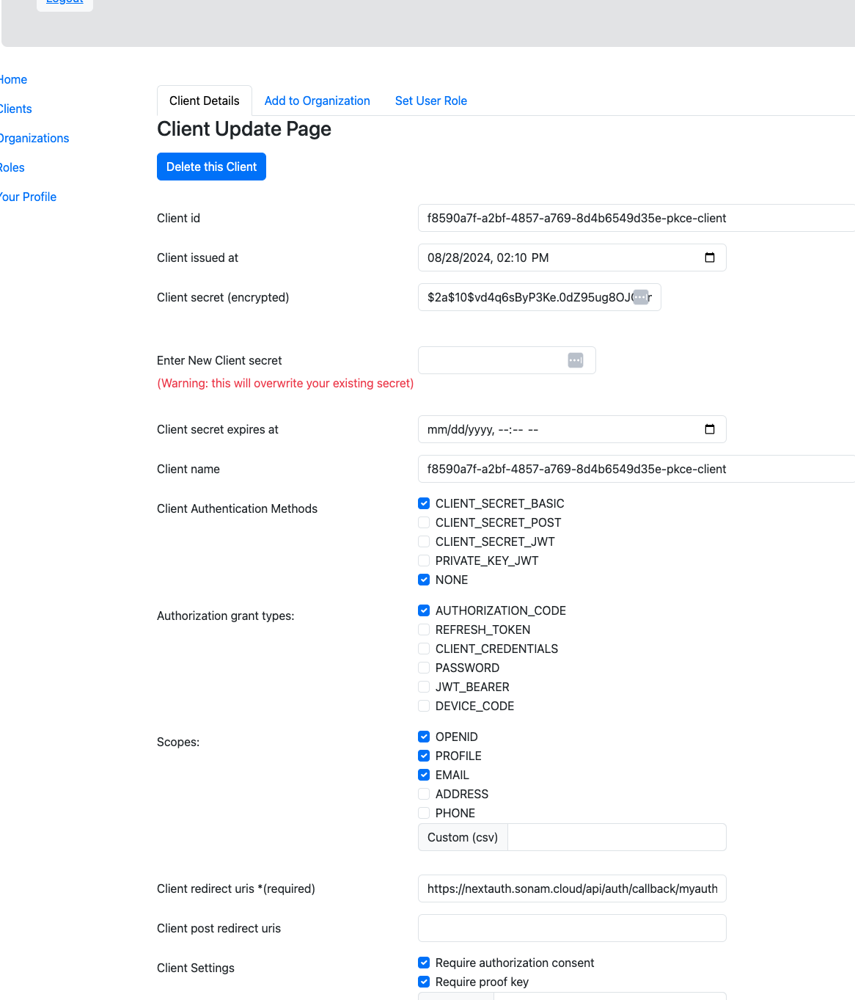
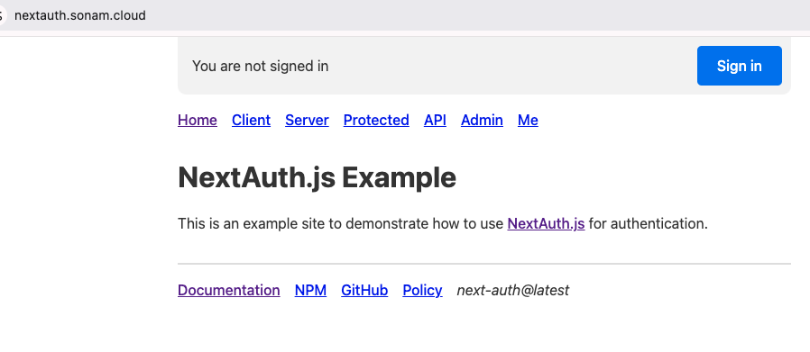
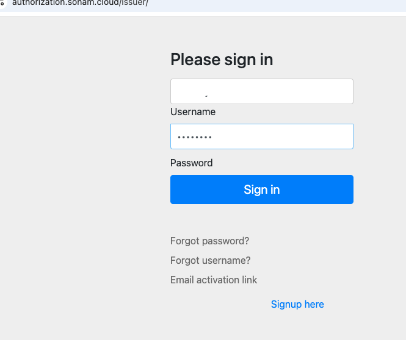
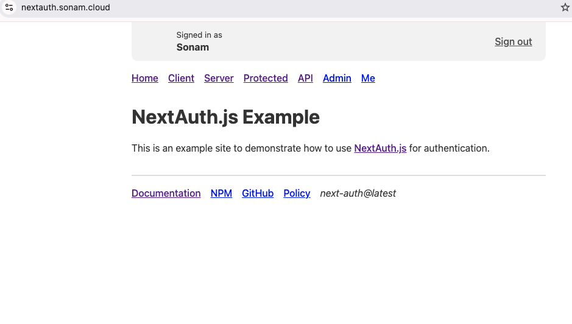

# Pkce client in Nextjs

I have come across several articles about creating public PKCE clients.  However, they end up  actually using the client secret in their configurations which is not what I would like to do.  Therefore, the purpose of this demo is to show that a public client can be created without using a client-secret.

This demo will create a Public PKCE client using [NextJS](https://nextjs.org/) with [NextAuth](https://next-auth.js.org/) api. 


For a official documentations on PKCE OAuth2 flow refer to [this](https://auth0.com/docs/get-started/authentication-and-authorization-flow/authorization-code-flow-with-pkce).


This is a short demo which will use my [authorization server](https://authorization.sonam.cloud/issuer), an OAuth2 server.  I will then show the Nextjs project that uses the NextAuth library to login and get user information.

## Create a Pkce Client in Authorization server
First we need to create a Public PKCE client on the Authorization server.
The following image show my pkce client configured on my authorization server:

 .

In my above client configuration the client secret is actually a empty space but it is encrypted which I am not going to use.

The client authentication method is done using `client_secret_basic` where it means that the client id is sent in the http header similar to basic authentication http header.  We also check `NONE` because we are using PKCE and we are going to be sending a `code_verifier` and a `code_challenge` pairs in our exchanges with the authorization server for receiving a token.  For more on this `NONE` read [this](https://cloudentity.com/developers/basics/oauth-client-authentication/client-auth-set-to-none-with-pkce/).

The grant types I have are `AUTHORIZATION_CODE` where we exchange authorization code for getting a token. 
  
I have also requested 3 scopes such as `OPENID`, `PROFILE` and `EMAIL` for displaying user information on the front end.

The redirect uris refers to where to redirect after successful authentication on my  authorization server.

We have now created our OAuth2 client.  In the next step we create the OAuth2 client in NextJS.

## NextJS client

I am using Nextauth for authentication/authorization with my authorization server.  I am going to refer to my [nextauth project](https://github.com/sonamsamdupkhangsar/next-auth-example) in my github repo as source for this demo.

I will show the user interfaces first because I find that it helps to demonstrate the core concepts easier.

I have deployed the repo on my server and is accessible at [nextauth.sonam.cloud](https://nextauth.sonam.cloud/): 

.

When the user clicks the `sign-in` button on the page above, the user will be directed to the authorization  sign-in page:

 

After entering your credentials with successful authentication, you will be directed to authenticated `Home` page as shown here:

 

This completes the demo from the UI side. Once authenticated you can see the username being printed on the authenticate home page.

To achieve this, you have to configure few things and they are done in this [[..nextauth].ts](https://github.com/sonamsamdupkhangsar/next-auth-example/blob/b37f16d9bc77c6658baecc48625c7738aa51c2d6/pages/api/auth/%5B...nextauth%5D.ts#L15) file.

First, I am using the `pkce-challenge` api to generate a  `code_challenge` and a `code_verifier` with a S256 hashing algorithm as follows:


```javascript
const pkce = await pkceChallenge(128)
```

In terms of workflow related to the pkce flow, the code_challenge is sent first in the authorization request when the sign-in button is clicked. Once the user enters their username/password in the sign-in page the code_verifier is sent to receive a token from the authorization server on a successful login.


The following code sets up a custom OAuth2 provider with my authorization server:
```javascript
export const authOptions: NextAuthOptions = {

  providers: [
    {
      id: "myauth",
      name: "SonamCloud",
      type: "oauth",
      clientId: clientId, 
      wellKnown: auth_server + "/.well-known/openid-configuration", 
      
```      

In the next block of code I am setting the parameters for authorization request. For this public pkce client I am setting `code_challenge: pkce.code_challenge` in authorization request which is sent to the OAuth2 server.

```javascript
authorization: {
        url:  auth_server+ "/oauth2/authorize?myvalue=ajksdfkjsdfi",
        
        params: { 
          scope: "openid email profile",
          prompt: 'Select Account',
          code_challenge: pkce.code_challenge,
          code_challenge_method: "S256",
          redirect_uri: host + "/api/auth/callback/myauth"
        },      
},       
```      

Once the user enters their credentials in the login page the application will forward the code verifier in the token request.  The following is the token endpoint configuration using Nextauth provider configuration.  This async function `const tokens = await makeTokenRequest(context)` is called which will send the token request. 
```javascript
 token: {
        url: auth_server + "/oauth2/token", 
  
        async request(context) {
          console.log("code: %s, redirect_uri: %s", context.params.code, context.params.redirect_uri)
          console.log("making token request");
          const tokens = await makeTokenRequest(context)          
          console.log('tokens: {}', tokens)
          return { tokens }
          }         
    
 ```

The `makenTokenRequest` mentioned above sets the code verfier and is shown below:

 ```javascript
async function makeTokenRequest(context: any) {
  console.log("params: ",context.params)
  console.log('host: ', host, ', nextAuthUrl: ', process.env.NEXTAUTH_URL)
  
  const formData = new URLSearchParams();
  formData.append('grant_type', 'authorization_code')
  formData.append('code', context.params.code)
  formData.append('client_id', clientId)
  formData.append('redirect_uri', host+ '/api/auth/callback/myauth')
  formData.append('code_verifier', pkce.code_verifier)
  
```

That is pretty much what is required to create a public PKCE client that does not use a client secret. 

 The public client will issue access tokens using my authorization server but will not issue refresh tokens at this time.
 
 The client is recommended to use short lived access tokens for this reason. 