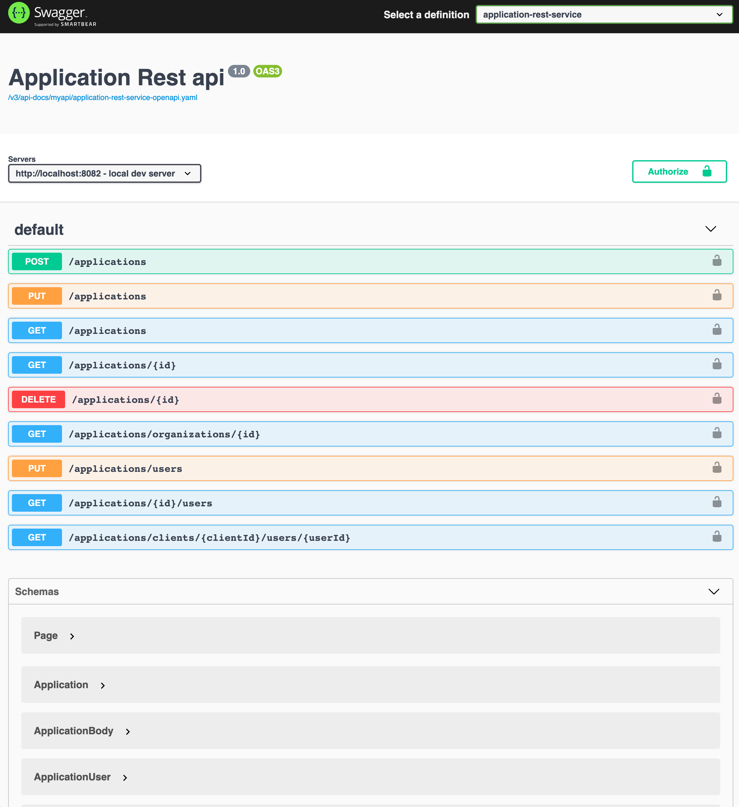
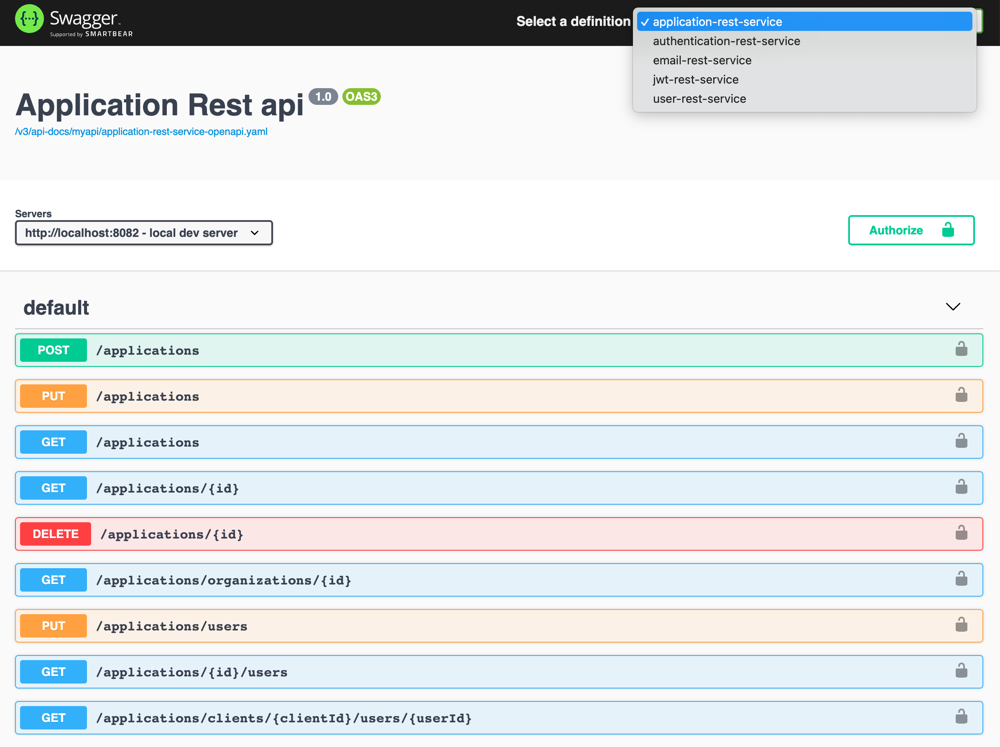

# Rest api catalog with Swagger UI
[Swagger UI](https://swagger.io/tools/swagger-ui/) is used for displaying your Rest api contract.  It can also be used for testing endpoints that are defined on the contract.   


Here is a picture of a Swagger UI with a Rest api contract:




<br/>
The API that is displayed on the SwaggerUI can be generated using vendor provided libraries or with Swagger libraries.  Or you can also feed in a contract file into the SwaggerUI so it can catalog the Rest api.  


## Generating Swagger UI contract 
There are two ways of generating the contract that is diplayed on the Swagger UI.  One of them is using the Swagger or vendor provided libraries.  The user can decorate the source code endpoints with Swagger annotations to mark the rest endpoints.  


For example, take the following example for Spring WebFlux project where the route is setup using functional programming:


```
@Configuration
@OpenAPIDefinition(info = @Info(title = "Account rest service Swagger doc", version = "1.0", description = "Documentation APIs v1.0"))
public class Router {
    private static final Logger LOG = LoggerFactory.getLogger(Router.class);

    @Bean
    @RouterOperations(
            {
                    @RouterOperation(path = "/accounts/active/{userId}"
                    , produces = {
                        MediaType.APPLICATION_JSON_VALUE}, method= RequestMethod.GET,
                         operation = @Operation(operationId="activeUserId", responses = {
                            @ApiResponse(responseCode = "200", description = "successful operation"),
                                 @ApiResponse(responseCode = "400", description = "invalid user id")}
                    ))
            }
    )
    public RouterFunction<ServerResponse> route(AccountHandler handler) {
        LOG.info("building router function");
        return RouterFunctions.route(GET("/accounts/active/{userId}")
        ...

```
Here the Swagger endpoint starts with `@OpenAPIDefinition` annotation that adds the API title and version information.  It then uses the annotation `@RouterOperation` with its attributes to define the endpoints, the type of MediaType response it produces, and response codes.

If you are programming with the servlet model using Springboot then your annotations may look a little different.  However, the idea is the same where the source code is annotated which generates the contract shown on the Swagger UI.


The other method is to create the contract using [OpenAPI](https://www.openapis.org/) specification in a yaml or json format.  I prefer this approach of creating the contract spec using a `openapi.yaml` in yaml format because it separates out the specification from the codebase.  It also leads to a cleaner code.   It can also be documented separately and used independently for any purpose without being tied to the implementation codebase. 

Additionally, the openapi.yaml contract file can also be shared among peers, between consumer and providers and be agreed upon using Github pull requests.  


## Cataloging API
There are a lot of Rest api that we build ourselves or other teams in a company but we don't know what exists in a company because we don't know where or what even exists and how to view them.  Yes, we can peek into git repositories but it would be hard to tell depending on how the Rest api is built and whether there is any specification file like a openapi.yaml file.  Usually, or mostly, there is lack of documentation.


One way to alleviate this problem is to catalog the Rest api using Swagger UI.   You can run the Swagger UI either using the nodejs git repository or embed the Swagger library in Java like how I have done.

For running nodejs Swagger UI:
```
git clone https://github.com/swagger-api/swagger-ui.git
cd swagger-ui
npm run dev
```
Then open to http://localhost:3200/ to see the Swagger UI running.

The other option is to integrate the Swagger UI into Java on Spring WebFlux.  You need to use the following maven dependencies:
```
  <dependency>
            <groupId>org.springdoc</groupId>
            <artifactId>springdoc-openapi-webflux-core</artifactId>
            <version>1.4.3</version>
        </dependency>
        <dependency>
            <groupId>org.springdoc</groupId>
            <artifactId>springdoc-openapi-webflux-ui</artifactId>
            <version>1.4.3</version>
        </dependency>
```

Once you have those in a Spring WebFlux project you can get a Swagger UI running by deploying the project using:
```
mvn spring-boot:run
```

To catalog the Rest api you will have to reference them in your folder somewhere. You can host the openapi.yaml files in the git repository folder `src/resources/static` or in specific folder `src/resources/static/v3/api-docs/myapi`.  You then need to reference them in your spring configuration as follows:

```

springdoc:
  swagger-ui:
    urls[0]:
      url: /v3/api-docs/myapi/application-rest-service-openapi.yaml
      name: application-rest-service
    urls[1]:
      url: /v3/api-docs/myapi/authentication-rest-service-openapi.yaml
      name: authentication-rest-service
    urls[2]:
      url: /v3/api-docs/myapi/user-rest-service-openapi.yaml
      name: user-rest-service
    urls[3]:
      url: /v3/api-docs/jwt/jwt-rest-service-openapi.yaml
      name: jwt-rest-service
    urls[4]:
      url: /v3/api-docs/email/email-rest-service-openapi.yaml
      name: email-rest-service
```

These apis are then visible locally on my machine:


You can navigate around the apis by selecting each definition listed on the pull down menu. 
