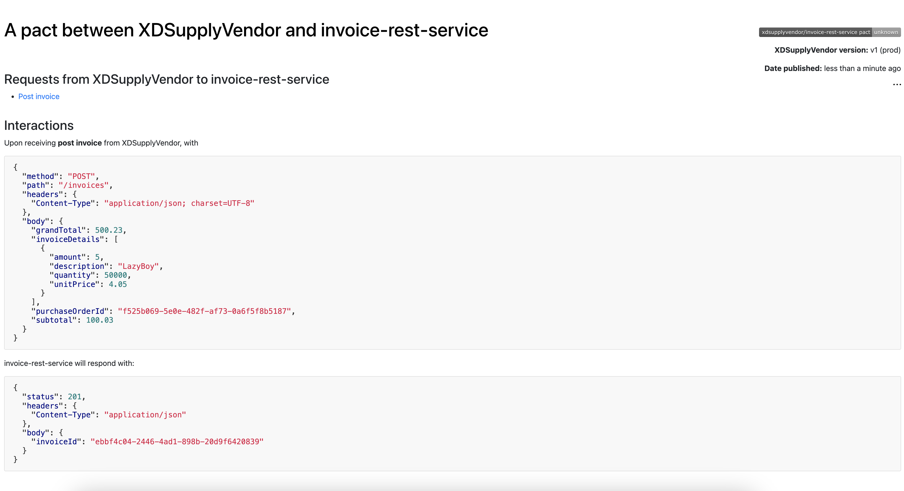

# Rest Api Contract Testing
OpenAPI helps to to specify the contract for a Rest service.  Once the contract is agreed by both consumer and provider it is published to a location where it can be viewed with like a Swagger UI.  

The service provider will work on building the service and the consumer will go to build their client interface using the contract specified in OpenAPI.  When the consumer is ready with their client code they can either setup a mock server to stub their client code so they can continute asynchronously while the provider is building their implementation.

While the client is waiting on the provider service to be ready they can build their service expectations using the examples served in the OpenApi contract file (taken from invoice-openapi.yaml file):
```
            example:
              purchaseOrderId: f525b069-5e0e-482f-af73-0a6f5f8b5187
              subtotal: 100.03
              grandTotal: 500.23
              invoiceDetails:
                - description: "Lzybody"
                  quantity: 50000
                  unitPrice: 4
                  amount: 5
```

The client can build a `pact` file or a service contract and publish it locally or to a `pact-broker` that will host all pacts.  This pact represents the client-service interaction and is now built based on some contract using a OpenAPI spec.  It is beneficial to publish the pact on pact-broker because it will be managed centrally and participants can view them without requiring manual interacation with each other.  The broker can also do more as we will see.

In order to build a pact file the client will use their favorite programming language.  It may also depend on what language integration is available for building pacts.  In the following I will show a exercise on creating a pact file in Java and also validate that the provider service implements to the specification.

## Creating a Consumer contract or pact file
The example used in this is in Java language on Spring WebFlux framework.  

This is the client pact file creation. In the spec it is defined that the provider will receive a Json request body containing the following items (the json values are examples only):
```
{
  "purchaseOrderId": "f525b069-5e0e-482f-af73-0a6f5f8b5187",
  "subtotal": 100.03,
  "grandTotal": 500.23,
  "invoiceDetails": [
    {
      "description": "Lzybody",
      "quantity": 50000,
      "unitPrice": 4,
      "amount": 5
    }
  ]
}
```
In response the OpenAPI spec says it will respond with a Http status code '201' for created with a response body containing such as: 

```{
  "invoiceId": "3fa85f64-5717-4562-b3fc-2c963f66afa6"
}
```

The client will build a pact file based on this interaction as follows:

```
1.  PactDslJsonBody invoiceDetail = new PactDslJsonBody()
2.           .stringType("description", "LazyBoy")
3.            .integerType("quantity", 50000)
4.            .decimalType("unitPrice", 4.05)
5.            .integerType("amount", 5);
6.
7.  private PactDslJsonBody pactDslJsonBody = new PactDslJsonBody()
8.            .stringType("purchaseOrderId", "f525b069-5e0e-482f-af73-0a6f5f8b5187")
9.            .decimalType("subtotal", 100.03)
10.            .decimalType("grandTotal", 500.23)
11.            .eachLike("invoiceDetails", invoiceDetail);
12. 
13. @Pact(provider="invoice-rest-service", consumer="XDSupplyVendor")
14. public RequestResponsePact createPact(PactDslWithProvider builder) throws Exception {
15.        LOG.info("create a consumer pact between XD supply client and Invoice rest api");
16.
17.    Map<String, String> headers = new HashMap<>();
18.    headers.put("Content-Type", "application/json");
19.
20.        return builder
21.            .uponReceiving("post invoice")
22.           .body(pactDslJsonBody)
23.            .path("/invoices")            
24.            .method("POST")
25.            .willRespondWith()
26.            .matchHeader("Content-Type", "application/json")
27.            .status(201)
28.            .body(new PactDslJsonBody().stringType("invoiceId", UUID.randomUUID().toString()))
29.            .toPact();
```

The lines from 1 to 11 sets up the Json payload using DSL.  The interaction or the pact file is created in the line 20 thru 29.  The code is clear enough that states upon receiving a quest to `post invoice` with a Json body on enpoint `/invoices` with method POST the service will send back a Http 201 with a Json payload in response with the invoice id.

### Client Mock Testing agains the pact file
Once the pact file is created the client can also run a test against it using a mock server to serve the payload and test the response.  This is done using a test harness as follows:
```
1.    @Test
2.    public void createMockInvoice(MockServer mockServer) throws IOException {
3.        LOG.info("starting mock server");
4.        HttpEntity httpEntity = new StringEntity(pactDslJsonBody.toString());
5.        LOG.info("httpEntity: {}",pactDslJsonBody.toString());
6.
7.        HttpResponse httpResponse = Request.Post(mockServer.getUrl() + "/invoices")
8.                .addHeader("Content-Type", "application/json; charset=UTF-8")
9.                .body(httpEntity)
10.                .execute()
11.                .returnResponse();
12.
13.        LOG.info("asserting 200 for success from mock server response");
14.        assertThat(httpResponse.getStatusLine().getStatusCode()).isEqualTo(201);
15.        LOG.info("assert json body contains valid");
16.        String gotBody = IOUtils.toString(httpResponse.getEntity().getContent(), "UTF-8");        
17.        JsonParser jsonParser = new JacksonJsonParser();
18.        Map<String, Object> map = jsonParser.parseMap(gotBody);
19.        assertThat(map.get("invoiceId")).isNotNull();
```

In this test the mock server is injected into the method on line 2.  On line 7 a post request is created and adds a "Content-Type" header with JSON payload request.  The mock server will validate the request against the pact and return the pact reponse.  On line 14, the Http status code value of '201' is asserted for a invoice creation response from the service.  On line 19, it is also asserted that a Json response with key of invoiceId has a value.


## Publish Conusmer Contract File
The consumer contract file can be distributed manually to others or stored on a central broker called "Pact Broker".  The advantage of using a broker is that contracts can be published manually or using CI tools.  Another advantage is that the provider can validate against the consumer contract using the broker also.
To publish a contract user can execute the following to publish a consumer contract file: 
```
mvn pact:publish
```

On Pact broker you should see the following contract visible:



## Service Provider Consumer Contract Verification
The service provider in the consumer driven contract testing can verify that its implementation meets the needs of the consumer according to the specification.  In a similar to how consumer created the pact the service can also verify that the provider implementation needs all the pacts of each consumer using a Pact Broker.

The provider will write a integration test case that indicates the provider service name and run the test the service implementation. 