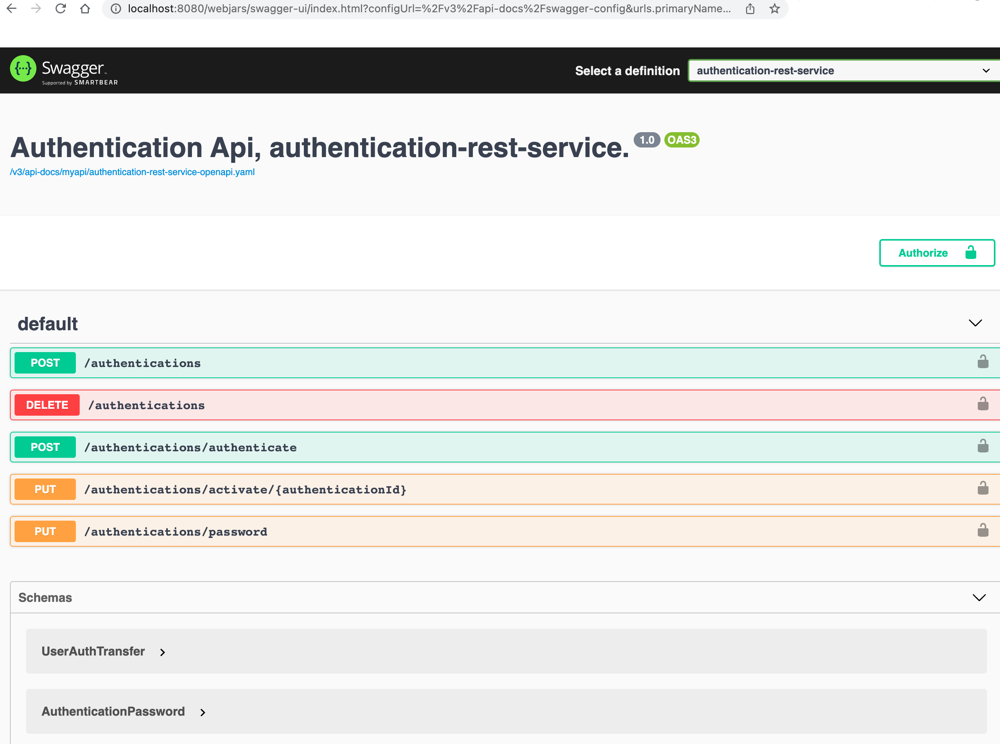
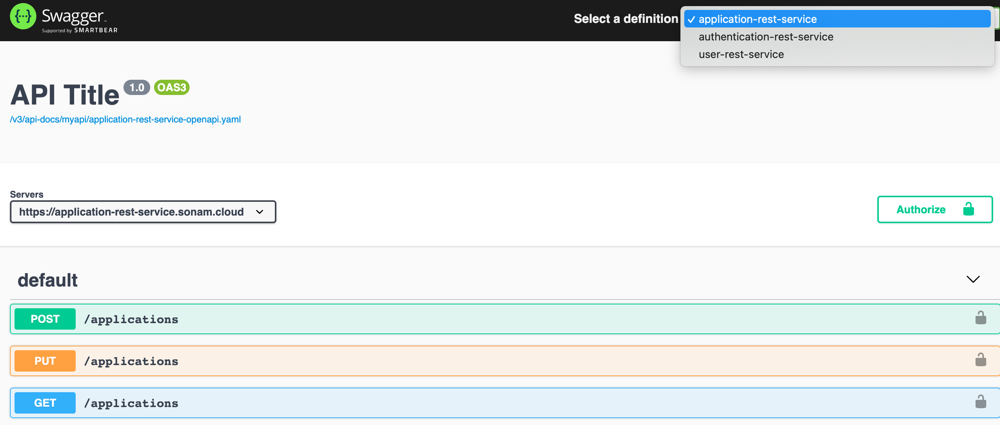

# Rest with OpenAPI specification
Date: January 5 2022

# Designing Webservice API
There are several approaches for building webservice API.  You can start at the bottom, meaning building the implementation first and then using annotation to mark the class or interface as the Rest endpoints as following Java example illustrates:
```
@Path("/s3")
public interface S3JaxrsService {

    @GET
    @Produces(MediaType.APPLICATION_OCTET_STREAM)
    @Path("/stream/{messageId}")
    Response getDocumentStream(@PathParam("messageId") String messageId);

    @GET
    @Produces(MediaType.TEXT_PLAIN)
    @Path("/{key}")
    Response getAsResponse(@PathParam("key") String key);
```


This approach was very common in my experience in the Java webservice when we were building SOAP services about a dozen years ago.  This approach of using Java annotation was used because either we were not familiar with the SOAP specification("spec") or just used the toolings to build the SOAP interface.

This approach of building from the bottom led to strange namespaces in the SOAP wsdl which had nothing to do with the company at all depending on what tooling you used for the wsdl generation.  This namespace would really have a impact on code generation because the packages would take the namespace names.


You can also take a middle way approach on building webservice api which is taking the generated spec such as Wsdl or the OpenApi spec from `openapi.yaml` using a tool such as Swagger.  The generated spec can be inspected and then ensuring that the naming convention conforms to the organization.  You can also re-create the class or interface from the spec to be sure your existing class or interface matches the spec but it is an extra effort.

# Top Down Design Rest API
This document will describe ways of building Rest api using Top Down approach.  Top Down as the name implies involves creating the Rest Api spec first.  

For building Rest specification there is RAML (Restful Api Modeling Langauge) which is used for building Rest api on the Mulesoft platform.  There is also (OpenAPI Specification) known as OAS [https://swagger.io/specification/] for building Rest specification using Swagger tools for creating and validating the OpenAPI spec files.

OpenAPI specification is simple to understand and can be shared easily with each other by hosting the spec files using the Swagger ui.  The naming convention for OpenAPI spec file is `openapi.json` for a json format or `openapi.yaml` for a yaml format.  The yaml format is easier to understand and write with just indentations.

The openapi.yaml file can describe the endpoints, the inbound request body and path parameters.  It can also describe the expected responses for a happy path and also the error responses.  This approach of building the spec file can level with all team members on the contract that each consumer and the provider will agree on.  The following is an example of a OpenAPI spec file for a sample authentication service:
```
openapi: "3.0.2"
info:
  title: Authentication Api, authentication service.
  version: "1.0"

security:
  - bearerAuth: []

paths:
  /authentications:
    post:
      description: Create a new authentication.  This api is called when a new user is signed up.
      requestBody:
        required: true
        content:
          application/json:
            schema:
              $ref: '#/components/schemas/UserAuthTransfer'
              example:
                authenticationId: rubberduck_1001
                password: 001231$1x
                clientId: uuid-number-generated-value
      responses:
        '201':
          description: Successfully created authentication
          content:
            text/plain:
              schema:
                type: string
                example:
                  text: uuid-value-of-authentication-id
        '400':
          description: Failed to create authentication
          content:
            text/plain:
              schema:
                type: string
                example:
                  text: some error code
```
In this OpenAPI file, I have a `authentications` endpoint that accepts a http post and requires a http body that conforms the schema mentioned.  It also gives an example of the json payload.  


Once you have the contract there are code generation tools that can be used to generate the stubs if needed.  The contract file can also be validated using the (swaggerui editor)[https://editor.swagger.io/] tool.  There are also tools for validating as part of the CI process.

It is best to put the spec file in a git repository for creating Pull Request for team members to review and version it.  Once the spec file has been agreed on you may also want to share it with others internally or to the external partners.

Swagger UI utitlity can be used to share the spec in a more friendly way across teams.  Swagger UI can be [run locally](https://swagger.io/docs/open-source-tools/swagger-ui/development/setting-up/) using the following steps:

```
git clone https://github.com/swagger-api/swagger-ui.git
cd swagger-ui
npm run dev
Wait a bit
Open http://localhost:3200/
```

Here is an example of a swaggerui instance running:



This screenshot example is running a SwaggerUI using a SpringFlux with Swagger plugin with some selected OpenAPI yaml.  Based on the spec definition selection using the pulldown menu only that spec is shown in detail to the user:



## Contract Testing
A service provider can build their implementation based on the  OpenAPI spec using their openapi.yaml file.  Similarly the client can also build their request using the spec also build their response behaviors using the response properties from the spec.


There will also be need for validating that the service provider and consumer are programming to the contracts specified in the openapi.yaml spec file.  To achieve this compliance a consumer can publish their expectations using a Pactbroker.  In return the service provider can gurantee that their service implementation meets the consumer's expectation based on the specification also.  


