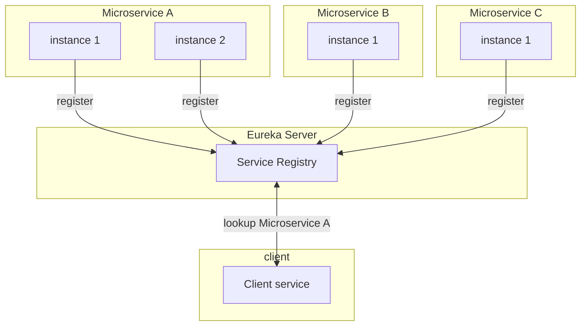
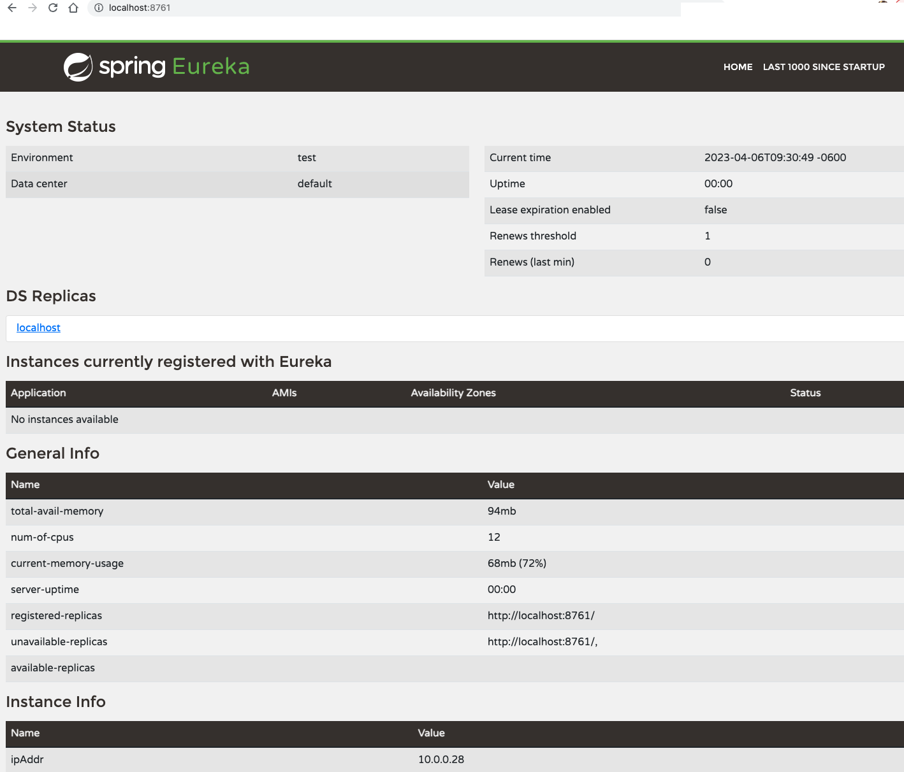
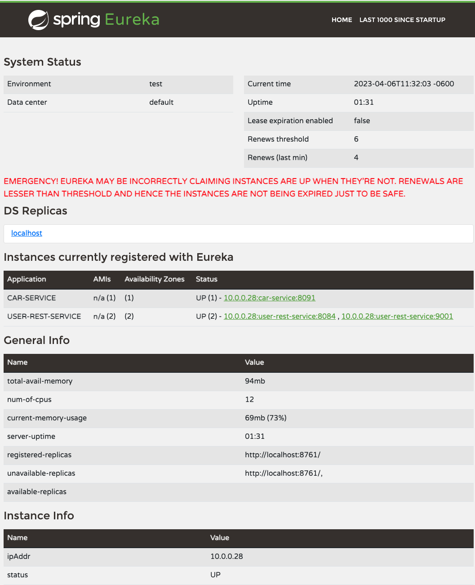

# Service Registry and Discovery for Microservices
This document shows how service registry and service discovery works.  It will use a Spring based Java application with Netflix's Eureka registry service.   It will then show how clients and microservices can use discovery service for communicating with each other, without needing to know the actual ip or dns addresses.

The following is a diagram of service registration and service discovery:



    

## What is a Service Registry?
Service registry is a framework used for registering services.  For example, a microservice can register themselves to a Eureka server.  Once registered the services can show up on the service registry using their configured name such as `hello-world-service` or by any other name. 

## What is Service Discovery?
Service discovery is the process by which the clients will use the registry to connect to a instance of a microservice using a name.


## How does registry and discovery work in Spring based application using Eureka server?
To use Eureka in Spring Java based application the Eureak server will need to be running.  
This Eureka server will act as the registry server where all the microservices can registry themselves.  Once registered, any client wanting to connect and communincate with each can use service discovery to find an instance of that service to establish communicatication.  

### Service Registry server
To run a Eureka registry server, based on the build environment, a Eureka server dependency will need to be included in a project.  I use Maven as my build and so use the following dependency in my `pom.xml` file:

```

<dependency>
			<groupId>org.springframework.cloud</groupId>
			<artifactId>spring-cloud-starter-netflix-eureka-server</artifactId>
		</dependency>
```

In the main application class where you have the `@SpringBootApplication` annotation you register this application as a Eureka server with `@EnableEurekaServer` as:

```

@EnableEurekaServer
@SpringBootApplication
public class EurekaServiceApplication {
	private static final Logger LOG = LoggerFactory.getLogger(EurekaServiceApplication.class);
    
    public static void main(String[] args) {
		SpringApplication.run(EurekaServiceApplication.class, args);
	}
    ...
```

In your configuration for the Eureka service registry do not forget to provide username and password credentials and other configurations such as hostname in your `application.yaml`:
```
eureka:
  client:
    instance:
      hostname: ${hostName}
    registerWithEureka: false
    fetchRegistry: false
    serviceUrl:
      defaultZone: ${defaultZone}

spring:
  main:
    allow-bean-definition-overriding: true
  security:
    user:
      name: ${EUREKA_USER}
      password: ${EUREKA_PASSWORD}
```      

Based on your profile you can define those properties in the `application-{profile}.yaml` such as in a application-local.yaml:
```
defaultZone: http://localhost:8761
EUREKA_USER: test
EUREKA_PASSWORD: test
```


You can then start your application with a mvn command using a local profile if you have one:
```mvn spring-boot:run -Dspring-boot.run.arguments="--spring.profiles.active=local"```

The following is a screenshot of the Eureka server running:




### Service Registration for Eureka clients
Applications and microservices that want to register to a Eureka discovery service  are the clients.  

The process for service registration is similar to how the Eureka service registry was configured.  You would need to define a Eureka client dependency in the build configuration for the microservice.  The following example uses a Maven build in a pom file:
```
        <dependency>
            <groupId>org.springframework.cloud</groupId>
            <artifactId>spring-cloud-starter-netflix-eureka-client</artifactId>
        </dependency>
```

In the microservices's main application class where you have the `@SpringBootApplication` annotation you register this application as a Eureka client with `@EnableEurekaClient` as:

```
@EnableEurekaClient
@SpringBootApplication
public class Application {
	private static final Logger LOG = LoggerFactory.getLogger(Application.class);
    
    public static void main(String[] args) {
		SpringApplication.run(Application.class, args);
	}
    ...
```

The Eureka client needs to access the discovery server which can be done in the application.yaml file:

```
eureka:
  client:
    serviceUrl:
      defaultZone: ${DEFAULT_ZONE}
```

The `${DEFAULT_ZONE}` value can be overridden in a profile specific file such as `application-local.yaml` file as:

```
DEFAULT_ZONE: http://${EUREKA_USER}:${EUREKA_PASSWORD}@${EUREKA_HOST}/eureka
```

When you start the microservice it should register itself with the Eureka discovery service using the local profile again.  The following shows a `user-rest-service` that has now registered with the discovery service:



In this example, you can find two instances of named `user-rest-service` that have registered with the discovery service and one `car-service` instance.  The names that show under the "Application" column are used for connecting to them.  This ability of a client to consume a service by their name ensures that there is no need to know  dns, ip or port information.  Consumers just need to know service name only.  

In the case of user-rest-service we have 2 horizontally scaled instances of the service registered.  This becomes useful not only for server side load balancing but also for the client side load balancing which we will see later.


### Service Discovery by clients


