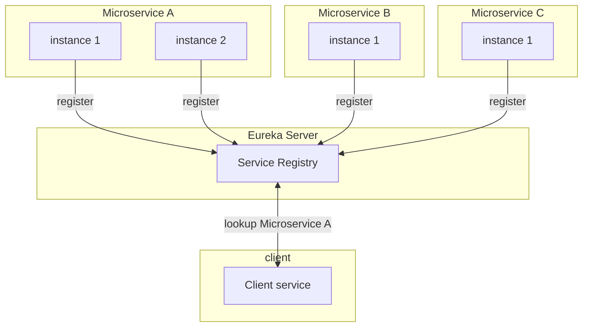

# Service Registry and Discovery for Microservices
This document shows how service registry and service discovery works.  It will use a Spring based Java application with Netflix's Eureka registry service.   It will show how clients and microservices can use discovery service for communicating with each other, without needing to know the actual ip or dns addresses.

The following is a diagram of service registration and service discovery:



    

## Service Registry
Service registry is a framework used for registering services.  For example, a microservice can register themselves to a Eureka server.  Once registered the services can show up on the service registry using their configured name such as `hello-world-service` or by any other name. 

## Service Discovery
Service discovery is the process by which the clients will use the registry to connect to a instance of a microservice using a name.


## How does registry and discovery work in Spring based application using Eureka server?
To use Eureka in Spring Java based application the Eureak server will need to be running.  
This Eureka server will act as the registry server where all the microservices can registry themselves.  Once registered, any client wanting to connect and communincate with each can use service discovery to find an instance of that service to establish communicatication.  

To run a Eureka registry server, based on the build environment, a Eureka server dependency will need to be included in a project.  I use Maven as my build and so use the following dependency in my `pom.xml` file:

```

<dependency>
			<groupId>org.springframework.cloud</groupId>
			<artifactId>spring-cloud-starter-netflix-eureka-server</artifactId>
		</dependency>
```

In the main application class where you have the `@SpringBootApplication` annotation you register this application as a Eureka server with `@EnableEurekaServer` as:

```

@EnableEurekaServer
@SpringBootApplication
public class EurekaServiceApplication {
	private static final Logger LOG = LoggerFactory.getLogger(EurekaServiceApplication.class);
    
    public static void main(String[] args) {
		SpringApplication.run(EurekaServiceApplication.class, args);
	}
    ...
```

In your configuration for the Eureka service registry do not forget to provide username and password credentials and other configurations such as hostname in your `application.yaml`:
```
eureka:
  client:
    instance:
      hostname: ${hostName}
    registerWithEureka: false
    fetchRegistry: false
    serviceUrl:
      defaultZone: ${defaultZone}

spring:
  main:
    allow-bean-definition-overriding: true
  security:
    user:
      name: ${EUREKA_USER}
      password: ${EUREKA_PASSWORD}
```      

Based on your profile you can define those properties in the `application-{profile}.yaml` such as in a application-local.yaml:
```
defaultZone: http://localhost:8761
EUREKA_USER: test
EUREKA_PASSWORD: test
```


You can then start your application with a mvn command using a local profile if you have one:
```mvn spring-boot:run -Dspring-boot.run.arguments="--spring.profiles.active=local"```

The following is a screenshot of the Eureka server running:


xtxv5795
